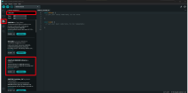

# 512 Final Project FAQ Autumn 2024

## **I'm lost and don't know where to start**

A: While there are many ways to approach this project, we recommend to get started by first selecting the programming language you want to use.
The three main languages you should consider are CircuitPython, Micropython, and Arduino (C/C++). We recommend CircuitPython or Arduino for your project because Adafruit has in depth tutorials in these languages for each of the peripherals given to you.
Tutorials on how to set up these programming languages are linked below:

- [CircuitPython](https://learn.adafruit.com/adafruit-qt-py-2040/circuitpython)
- [Micropython](https://micropython.org/download/ADAFRUIT_QTPY_RP2040/)
- [Arduino](https://learn.adafruit.com/adafruit-qt-py-2040/arduino-ide-setup)

Once you have installed a programming language, your next step should be to pick the right IDE to interface with your microcontroller. Depending on the Programming language you chose, we recommend these IDEs:

- [CircuitPython - Mu Editor](https://codewith.mu/)
- [Micropython - Thonny](https://thonny.org/)
- [Arduino - Arduino IDE](https://www.arduino.cc/en/software)

With a programming language installed and IDE setup, your next steps should be to connect each peripheral one at a time and run sample code to make sure they are connected and working properly.

## **How do I install libraries for my peripherals**

Each programming language has its own way of installing libraries:

### CircuitPython 
To install CircuitPython Libraries it is recommended to download the Adafruit CircuitPython Library Bundle that can be found [here](https://circuitpython.org/libraries). Once you have downloaded and unzipped the bundle, search for the library you need and drag and drop the folder/file into the lib folder on your microcontroller with CircuitPython installed (your computer should recognize it as a drive).

### Micropython
To install Micropython libraries in Thonny you can use the package manager in the tools menu at the top (make sure to be in the directory of your Micropython device). The package manager does not always have the Micropython libraries you might be interested in. Therefore, the recommended way to install libraries is to find the one you are looking for online (usually on Github) copy the contents of the file that has the library code, create a new file on your Micropython device, and copy/save the contents of the library in the file that you created.

### Arduino IDE 
You can download Arduino libraries directly from the IDE. Click on the library manager button on the left side panel. In the text box enter the name of the library you are looking for. If you can find one written by Adafruit it is recommended to use that one.

## **My Microncontroller is not recognizing my sensor**

A: First check that your wiring is correct

For an I2C sensor you can run code to scan for I2C addresses that your microcontroller can see. Code for the I2C scanner is linked below:
- [CircuitPython I2C Scanner](https://learn.adafruit.com/scanning-i2c-addresses/circuitpython)

- [Micropython I2C Scanner](https://randomnerdtutorials.com/raspberry-pi-pico-i2c-scanner-micropython/)

- [Arduino I2C Scanner](https://learn.adafruit.com/scanning-i2c-addresses/arduino?gad_source=1&gclid=CjwKCAiA3Na5BhAZEiwAzrfagKycm_r6hAFwfoswsncHn7iqdMzZ7a6kKu5bZ0ul8lXuBAkz3w4nMBoC5CcQAvD_BwE)

Most Libraries for I2C devices assume a default I2C address which may not be the same of the device you are currently using. For example, the CircuitPython BME280 library assumes a default address of 0x77. Most of the BME280 devices given to the class have an address of 0x76. In most cases you can set the I2C address in the constructor of the driver code.

## **There are only two I2C pins on my microncontroller, how do I connect more than one to my device**

A: I2C devices can share the same SDA and SCL pins since they have unique addresses. Issues will arise when you try and utilize more than one device with same address.

## **How do I work with perfboard?**

- [Perfboard Prototyping](https://www.youtube.com/watch?v=3N3ApzmyjzE)
- [Soldering Perfboard](https://www.youtube.com/watch?v=l9Kbr8cPqOE)
- [Perfboard Tips](https://www.digikey.com/en/maker/blogs/2022/start-building-cleaner-perfboard-projects-using-these-simple-tips)

It is highly recommended that you use female headers to attach your microcontroller and peripherals/sensors to your perfboard. This will allow you to remove components from the perfboard in case you mess up any of your soldering.

## **How do I connect a lipo battery to perfboard?**

A: For the RP2040, the voltage in pin for batteries is the one labeled 5V. To connect a battery you will need a JST-PH male header and a switch (SPDT is preferred and what will be used as reference). Solder the JST-PH header and switch to your perfboard, make sure to take notice which pin on your JSTPH header is voltage and ground. Solder a jumper wire from your header to the middle pin of your switch. Solder a jumper wire from one of the outside pins of the switch to the 5V pin of your microncontroller.Finally, Solder a jumper wire from ground of the JST-PH header to the ground pin of your microcontroller.

## Useful links
### QT PY Board Info
- [RP2040 Overview](https://learn.adafruit.com/adafruit-qt-py-2040/overview)
- [QT PY RP2040 - Pinouts](https://learn.adafruit.com/adafruit-qt-py-2040/pinouts)

### SSD1306 OLED
- [CircuitPython](https://learn.adafruit.com/adafruit-oled-featherwing/python-circuitpython-wiring)
- [Micropython](https://randomnerdtutorials.com/raspberry-pi-pico-ssd1306-oled-micropython/)
- [Arduino](https://randomnerdtutorials.com/guide-for-oled-display-with-arduino/)

### MPU6050
- [CircuitPython](https://learn.adafruit.com/mpu6050-6-dof-accelerometer-and-gyro/python-and-circuitpython?gad_source=1&gclid=Cj0KCQiA_9u5BhCUARIsABbMSPvj5ua6Z8uzGx_uOqEhm6sc8uKHUWFvedA41SZmerjldLei-rUug_QaAvEIEALw_wcB)
- [Micropython](https://microcontrollerslab.com/micropython-mpu-6050-esp32-esp8266/)
- [Arduino](https://randomnerdtutorials.com/arduino-mpu-6050-accelerometer-gyroscope/)

### APDS9960
- [CircuitPython](https://learn.adafruit.com/adafruit-apds9960-breakout/circuitpython?gad_source=1&gclid=Cj0KCQiA_9u5BhCUARIsABbMSPueoj8fIOxQNcsqS4Mrq1uDb0nutoY-wlmi3jeBcC3LkdWJpE0tS4UaAt3MEALw_wcB)
- [Micropython](https://upy-apds9960.readthedocs.io/en/latest/)
- [Arduino](https://learn.adafruit.com/adafruit-apds9960-breakout/arduino-wiring-and-test)