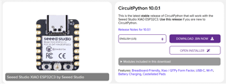

# Final Project Take-Home Assignment 2

## Goals
The objectives of this assignment are:
- Learn how to setup Circuitpython on your microcontroller
- Installing Circuitpython libraries
- Interfacing with SSD1306 OLED Screen
- Interfacing with the Rotary encoder

## Setting up Circuitpython

To install Circuitpython on your microcontroller go to this [website](https://circuitpython.org/downloads). In the search bar type in the microcontroller you are using, in this case it is Xiao ESP32C3. 

