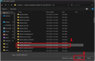

# Final Project Take-Home Assignment 2

## Goals
The objectives of this assignment are:
- Learn how to setup Circuitpython on your microcontroller
- Installing Circuitpython libraries
- Interfacing with SSD1306 OLED Screen
- Interfacing with the Rotary encoder
- Interfacing with ADXL345 Accelerometer

## Deliverables

Anything marked with a ✏️ must be included in your deliverable. Your final deliverable will be a pdf containing any pictures and code (screenshot or copy/pase are both acceptable) asked for. Please make sure your responses are ordered in the same way as they are given (Responses to Interfacing with SSD1306 OLED Screen should be first, Rotary Encoder Second, and Accelerometer Third). Title each section of your responses so that they correspond to the section you are giving your answers to.

## Useful Resources
**It is okay to use the Web and ChatGPT/LLMs to aid you in completing this assignment.**

Adafruit guide to getting started with [Circuitpython.](https://learn.adafruit.com/welcome-to-circuitpython/overview)


This section contains links to documentation of the libraries you will be using in this assignment:
- [time](https://docs.circuitpython.org/en/latest/shared-bindings/time/index.html)
- [displayio](https://docs.circuitpython.org/en/latest/shared-bindings/displayio/)
- [busio](https://docs.circuitpython.org/en/latest/shared-bindings/busio/)
- [board](https://docs.circuitpython.org/en/latest/shared-bindings/board/index.html#module-board)
- [terminalio](https://docs.circuitpython.org/en/latest/shared-bindings/terminalio/index.html)
- [Adafruit Display Text](https://docs.circuitpython.org/projects/display_text/en/latest/)
- [i2cdisplaybus](https://docs.circuitpython.org/en/latest/shared-bindings/i2cdisplaybus/index.html)
- [Adafruit Displayio SSD1306](https://docs.circuitpython.org/projects/displayio_ssd1306/en/latest/)
- [rotaryio](https://docs.circuitpython.org/en/latest/shared-bindings/rotaryio/index.html)
- [Adafruit ADXL34X](https://docs.circuitpython.org/projects/adxl34x/en/latest/)

## Setting up Circuitpython

To install Circuitpython on your microcontroller go to this [website](https://circuitpython.org/downloads). In the search bar type in the microcontroller you are using, in this case it is Xiao ESP32C3. 


Connect your Xiao ESP32C3 to your computer and click on OPEN INSTALLER. Follow the directions until you have successfully installed Circuitpython on your ESP32. If you are having difficulties installing Circuitpython using the web installer, download the .BIN file and follow the instructions [here.](https://learn.adafruit.com/circuitpython-with-esp32-quick-start/web-serial-esptool)

Verify that you have successfully installed Circuitpython by opening Thonny and checking if it recognizes your board. Be sure to check if your Thonny interpreter is set to Circuitpython and you have selected your board's COM port. You'll know if Thonny recognizes your board if in the bottom right corner it has the COM port associated with your ESP32 and if in the shell you see >>> in blue text like the image below. You might have to click the Red Stop button at the top to get Thonny to successfully connect to your board.


## Installing Circuitpython Libraries

Adafruit maintains a majority of the libraries for Circuitpython that can be downloaded [here.](https://circuitpython.org/libraries) On the library download page be sure to select the bundle pack that matches the version of Circuitpython that you installed.


Once you have downloaded the zip file for the library bundle, extract the contents to somewhere you will remember on your computer.

For this assignment, you will need libraries for the SSD1306 OLED and ADXL345 Accelerometer. For the SSD1306 OLED the libraries you will need are adafruit_display_text, adafruit_displayio_ssd1306, and adafruit_bus_device. For the ADXL345 Accelerometer the library is adafruit_adxl34x.

Open the library bundle folder that you unzipped. Check to make sure there is at least two folders in there named examples and lib. The examples folder contains example scripts for the various libraries and the lib folder has all of the libraries.


Next we will go into the process to install libraries on the Xiao ESP32C3. Normally, for Circuitpython, to install libraries you would drag and drop the library file/folder into the Circuitpython drive that would appear on your computer when you connect the microcontroller to it. Since the Xiao ESP32c3 does not support native USB it will not appear as a drive on your computer. To install libraries, we will instead need to connect our Xiao ESP32C3 to the internet and use a web interface to install the libraries. _**The process described below will generally not work on any UW wireless networks. Please use your home wifi, if you do not have access to a personal wifi please let the teaching staff know.**_

Connect your ESP32 to your computer and open Thonny. Make sure Thonny recognizes your ESP32. Start a new file by pressing the green plus sign near the top left corner of the window. Copy and paste the lines below into the new file.


```
CIRCUITPY_WIFI_SSID = "Your WIFI SSID"
CIRCUITPY_WIFI_PASSWORD = "Your WIFI Password"
CIRCUITPY_WEB_API_PASSWORD = "webpassword"
```

_**You must select a WiFI network that is 2.4GHz, ESP32 does not support connecting to 5GHz networks.**_. The WIFI_SSID field should be changed to the name of the wifi network you want to connect to. The WIFI_PASSWORD field should be the password for your wifi, and the WEB_API_PASSWORD can be anything you want it to be. Each field should keep the quotation marks.

When you have complete changing those values, save the file. Thonny will prompt you asking if you want to save it on your computer or onto the Circuitpython device. Choose Circuitpython device. Save the file with the name Settings.toml.

_**If you are not using Thonny or an IDE that lets you save files to the ESP32 you can use the REPL/Shell to create the Settings.toml file.**_


After you have saved the Settings.toml file, you will need to reset your ESP32. You can hit the red button in Thonny or unplug and re-plug your ESP32. Your ESP32 should now automatically connect to the wifi network. You'll know that it has connected to the internet if Thonny displays the IP address of the board in the shell as seen in the image below. If your ESP32 does not connect to the internet on reset, double check that your Settings.toml file has the correct information. It might take multiple resets for your ESP32 to successfully connect to the WiFi.


Make sure your computer is on the same wifi network as the ESP32. Open a web browser and go to [http://circuitpython.local/](http://circuitpython.local). If the link does not work, you can also use the IP address of your ESP32. The page should look like the one in the image below. Click on the file browser link.


**You will be prompted enter a username and password. Leave the username field empty and for the password use the WEB_API_PASSWORD you saved in your Settings.toml file.**

We now have access to the ESP32 file system. Click on the lib folder, this is where we will upload the libraries we downloaded earlier. In the lib folder, you will have a list of all libaries on your ESP32. If there are no libaries on your ESP32, you will only see two choose files buttons. One choose files button has a file icon next to it and the other has a folder icon. If the library you want to upload is a singular file you pick the Choose Files button with a File icon next to it and if the library is a folder you use the Choose Files button with the Folder Icon.


The first library we will upload is adafruit_display_text which is a library contained in a folder. Click the Choose Files button with a folder next to it.


Navigate to the library bundle folder that you unzipped earlier and search for the adafruit_display_text folder.



The library you just uploaded should now appear in the list of libraries. Repeat this process to upload the following libraries:

- adafruit_displayio_ssd1306 (File)
- adafruit_bus_device (Folder)
- adafruit_adxl34x (File)

Your lib folder should look likes when you are finished uploading:


**At this point you can now delete the Settings.toml file so you can avoid errors when your ESP32 tries to connect to WiFi and it is out of range.**

Whenever you need to add more libraries to your ESP32C3 refer to this process. Remember, this process for uploading libraries is only necessary for microcontrollers that do not support native USB. If in the future you have a microcontroller that does support native USB you will be able to drag and drop the library files onto your microcontroller.

## Interfacing with SSD1306 OLED

The SSD1306 OLED given to you in your final project kits is a 128x64 monocolor OLED screen that uses i<sup>2</sup>c to interface with the microcontroller. Wire the SSD1306 OLED to your Xiao ESP32C3 as seen in the picture:


Copy the sample code below and run it on your ESP32. This should print Hello World on your OLED screen.
```
import board
import busio
import displayio
import terminalio
from adafruit_display_text import label
import i2cdisplaybus
import adafruit_displayio_ssd1306
 
displayio.release_displays()
 
i2c = busio.I2C(board.SCL, board.SDA)
display_bus = i2cdisplaybus.I2CDisplayBus(i2c, device_address=0x3C)
display = adafruit_displayio_ssd1306.SSD1306(display_bus, width=128, height=64)
 
main_group = displayio.Group()
text_layer = label.Label(terminalio.FONT, text="Hello World!", x=10, y=30)
main_group.append(text_layer)
 
display.root_group = main_group
```

✏️Update the code so that instead of printing Hello World to the OLED screen it prints your name and have your name centered on the screen both horizontally and vertically. Take a Picture of your OLED.


✏️Comment each line of code explaining what it is doing. You do not need to add comments for the lines of code importing from libraries.


## Interfacing with the Rotary Encoder
Adafruit has a great overview on what a Rotary Encoder is, and how it works that you can find [here.](https://learn.adafruit.com/rotary-encoder/overview)


Follow the wiring guide [here](https://learn.adafruit.com/rotary-encoder/hardware) on how to connect a rotary encoder to a microcontroller. The guide does not use a Xiao ESP32 so be careful which pins you connect the Rotary Encoder to. Once you have connected your Rotary Encoder, copy and run the code below. **Make sure to change the pin numbers on line 4 to be consistent with the pins you connected your Rotary Encoder to.**

```
import board
import rotaryio

encoder = rotaryio.IncrementalEncoder(board.D1, board.D0)
lastPosition = None
while True:
    position = encoder.position
    if lastPosition is None or position != lastPosition:
        print(position)
    lastPosition = position
```

After the code is uploaded to your ESP32, when you turn the rotary encoder it should print out a number (position) to your shell/serial console that is either increasing or decreasing based on which way you turn the encoder.

✏️ Update the code so that the number is printed onto the OLED Screen. Make sure the number is centered in on the OLED screen. Take a picture of your OLED Screen and make sure the updated code is in your report.

✏️ Further update the code even more so that instead of a number being printed it is the letters of the English Alphabet where the letter A is mapped to position zero. For example if you turn the rotary encoder clockwise it should go from A→B→C→D......→Z→A, following the alphabet all the way to Z. Once it reaches Z it should wrap around back to A if you keep turning the encoder. The inverse should be true if you turn the encoder counter-clockwise, it should print out the Alphabet backwards: A→Z→Y→X→W.....→B→A→Z. Take a picture of your screen and make sure the updated code is in your report.

## Interfacing with ADXL345 Accelerometer

### Acceleration Readings
The ADXL345 Accelerometer uses i<sup>2</sup>c to interface with your ESP32. Wire it to your ESP32 the same way you did with your OLED. You can keep your OLED connected to your ESP32 and have the OLED screen and ADXL345 share the SDA and SCL pins of the ESP32. This is okay since both devices have different addresses. Copy and run the code below to have the ADXL345 print acceleration values to your shell/serial console.

```
import board
import time
import adafruit_adxl34x

i2c = board.I2C() 

accelerometer = adafruit_adxl34x.ADXL345(i2c)

while True:
    print("{} {} {}".format(*accelerometer.acceleration))
    time.sleep(0.4)
```

Update the code so that the acceleration values are printed in the center of the OLED Screen. Take a picture of your OLED Screen.

### Recognizing Taps

The ADXL345 has a clever built-in feature that lets you easily recognize when the sensor has been tapped once or twice. Copy and Run the code below for single tap detection.
```
import board
import time
import adafruit_adxl34x

i2c = board.I2C()  

accelerometer = adafruit_adxl34x.ADXL345(i2c)
accelerometer.enable_tap_detection()

while True:
    
    print("Tapped: {}".format(accelerometer.events["tap"]))
    time.sleep(0.5)
```

✏️Update the code so that the ADXL345 looks for a double tap event instead of a single one. There are to main options to accomplish this: Write your own code that is able to detect two single taps as a double tap event or update the paramters of the enable_tap_detection method to recognize a double tap event. You may find the examples found in the [ADXL345 Library Github](https://github.com/adafruit/Adafruit_CircuitPython_ADXL34x/tree/main) page useful to accomplish this task. Make sure to add the updated code to your report.