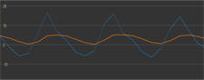

# Final Project Take-Home Assignment 3

## Goals
- Learn Filtering/Calibration Techniques for the accelerometer 
- Detect directional movement with the accelerometer
- Interfacing with NeoPixels 
- Interfacing with Push Buttons
- Creating Helper Functions

## Deliverables

Anything marked with a ✏️ must be included in your deliverable. Your final deliverable will be a pdf containing any pictures and code (screenshot or copy/pase are both acceptable) asked for. Please make sure your responses are ordered in the same way as they are given. Title each section of your responses so that they correspond to the section you are giving your answers to.

## Useful Resources

- [Guide to Helper Functions](https://www.geeksforgeeks.org/javascript/what-are-the-helper-functions/#)
- [Push Buttons](https://learn.adafruit.com/multi-tasking-with-circuitpython/buttons)
- [Debouncing in Circuitpython](https://learn.adafruit.com/debouncer-library-python-circuitpython-buttons-sensors/basic-debouncing)
- [Neopixels in Circuitpython](https://learn.adafruit.com/circuitpython-essentials/circuitpython-neopixel)
- [Infromative article about Accelerometer Calibration](https://thecavepearlproject.org/2015/05/22/calibrating-any-compass-or-accelerometer-for-arduino/)


## Filering/Calibrating Accelerometers

There are many filters and techniques available to help increase the accuracy and reduces the noise for accelerometers. Generally, you would perform a Fourier Transform on the signals output from your accelerometer to get a better idea of what filters would work for you. However, since you have not taken TECHIN 513 yet we will not go into that process. We will instead look into and implement some common filters that are used with accelerometers.

### Zero Offset Calibration

Before we get into filters we will perfrom a simple calibration process for the accelerometer. If we have the accelerometer sitting flat on a table we would expect that acceleration in the X and Y axis to be zero and 9.81 m/s in the Z axis. This is almost never the case, if you were to take readings with your accelerometer laid flat and not moving you would get some small readings for X and Y and readings around but precisely 9.81 m/s for Z. Zero Offset Calibration helps compensate for this. There are multiple ways to implement this type of calibration, but we will focus on a more novel way to accomplish it.

The way we will implement Zero Offset Calibration is to take some amount of sample readings for each axis and then take the average of those readings and store those values into variables. Those variables are usually referred to as the baseline. To complete the calibration, everytime we take a reading we will subtract the baseline from the raw reading of the accelerometer.

✏️ Implement Zero Offset Calibration using the method described above. Here is an itemized list of what the process should be:

- Take at least 20 readings for each axis and get the average
- store the average for each axis into their own variable. These variables are storing the baseline
- Take a reading from the accelerometer and substract the baselines from them.

**Be warned that if you do this process with the Z-axis then it would also give calibrated values close to zero. This is fine depending on your application.**

Here is some starter code to help you:
```
import board
import time
import adafruit_adxl34x

i2c = board.I2C() 

accelerometer = adafruit_adxl34x.ADXL345(i2c)

x, y, z = accelerometer.acceleration # This is how you save accelerometer readings into variables
```
There are multiple ways you can get the average of the readings. Two examples are saving the readings in lists, use the sum built-in function and divide by the length of the list or you can instantiate variables that hold the sums and add to these variables everytime you take a reading and then divide by the number of readings. Both examples require you to code a loop to take the readings.

✏️ Once you have accomplished the calibration print out raw and calibrated readings for each axis to your shell and take a screenshot. Be sure to add your code to your deliverable as well.

### Filtering

There are many filters that are commonly used for accelerometers but this assignment will introduce the following: Lowpass Filter, Highpass Filter, and Magnitude Filter.

#### Lowpass Filtering
One of the most popular lowpass filters used for sensors is the [Exponential Moving Average](https://en.wikipedia.org/wiki/Exponential_smoothing) (EMA) filter. This filter is very good at smoothing out the readings and eliminates high frequency noise caused by jitter, vibration, EMI, etc. One of the big reasons this filter is popular in microcontroller applications is how easy it is to implement.

Here is the equation to implement this filter: **signalFiltered = alpha * rawSignal + (1 - alpha) * signalFiltered**

Where alpha is known as the smoothing factor. The lower alpha is the more your signal smoothed. Typical alpha values range from 0.1 - 0.6. The higher alpha is the less effect the filter will have on your signal. Notice in the equation that signalFiltered depends on itself. Since accelerometer signals are time series data, current filtered outputs depend on past filtered values. Obviously, the first output of the filter has no past data to work with so you will have to initialize those. Common practices are initializing with raw data readings or with zeroes.

To get a better idea on how this filter effects your signal here is an image where the blue line represents the y-axis reading of the accelerometer and the orange line shows the filtered y-axis reading.



✏️ Implement EMA filtering on all axis of the accelerometer. Here is some starter code to help you out
```
import board
import busio
import adafruit_adxl34x

i2c = busio.I2C(board.SCL, board.SDA)
accelerometer = adafruit_adxl34x.ADXL345(i2c)

alpha = 0.2  # smoothing factor

xFiltered, yFiltered, zFiltered = accelerometer.acceleration # Initializing for first filter output

while True:

    #todo get raw data readings from accelerometer
    #todo use EMA to filter each axis
    #todo print raw data readings and filtered data readings
```
✏️ For your deliverable provide your code, a screenshot of the printed raw and filtered data values and three screenshots that contain raw and filtered data plot like the image above for each axis. To get plots on Thonny click on the View menu at the top and click on Plotter. What shows up on the plot is dependent on what you are printing to the Shell. For example, the picture above was genereated through this code:
```
print(f"Raw: {y}  Filtered: {yFiltered}")
```


#### Highpass Filtering

[Highpass filters](https://en.wikipedia.org/wiki/High-pass_filter) work in the opposite way that low pass filters do. Instead of smoothing out the function they work well to accentuate sharp changes in acceleration such as jitter, jerk, vibration, etc. A popular highpass implementation used with microcontrollers is the first order IIR (inifinte impulse response) High-Pass filter.

Here is the equation implementation for this filter: **signalFiltered = alpha * (signalFiltered + rawSignal - rawSignalPrevious)**

Like the EMA filter this filter's current output is also dependent on the previous output of the filter. Addtionally, this filter output is dependent on the previous rawSignal reading. Common Alpha values range from .3 to .95. 

✏️Implement the First Order IIR Highpass Filter. Here is some starter code to help you:
```
import board
import busio
import adafruit_adxl34x

i2c = busio.I2C(board.SCL, board.SDA)
accelerometer = adafruit_adxl34x.ADXL345(i2c)

alpha = 0.7 

xFiltered, yFiltered, zFiltered = 0 # Initializing to zero since xPrev, yPrev, and zPrev are also zero
xPrev, yPrev, zPrev = 0

while True:

    #todo get raw data readings from accelerometer
    #todo use HP IIR to filter each axis
    #todo print raw data readings and filtered data readings
```
✏️For your deliverable provide your code, a screenshot of the printed raw and filtered data values and three screenshots that contain raw and filtered data plot for each axis.

#### Magnitude Filtering

The last filter we will look into is the Magnitude Filter. This filter is good for detecting motion (Note: Not good for determining direction of motion) and is easy to implement. This filter combines data from all three axis into a single variable and is generally compared to a threshold to determine if movement occured or not. The equation for this filter is the same as the ones you have encountered in your math and physics classes.

The equation for this filter is: **signalFiltered = square-root(rawX<sup>2</sup> + rawY<sup>2</sup> + rawZ<sup>2</sup>)**

✏️ Implement the Magnitude Filter. Here is some starter code:
```
import board
import busio
import adafruit_adxl34x

i2c = busio.I2C(board.SCL, board.SDA)
accelerometer = adafruit_adxl34x.ADXL345(i2c)

while True:

    #todo get raw accelerometer readings
    #todo implement magnitude filter
    #todo print raw and filtered readings
```

✏️ After you are able to successfully implement the magnitude filter, write a script that uses your Magnitude Filter to detect movement. To do this determine a threshold that your accelerometer much reach to be considered movement. You should also implement that the accelerometer should be at or exceed the threshold for a certain amount of time/loops to be considered movement. This script should print to your Shell "MOTION DETECTED" whenever it deteccts movement. **Make sure to take into account that the Z-axis is effected by gravity**

✏️ The deliverable for this section should include code for both your Magnitude Filter and Motion Detector script. Include Screenshots of raw and filtered data outputs.


## Detecting Direction with Accelerometer

Determining which direction an accelerometer is moving in an accurate and precise way is a non-trivial process. We will mainly focus on a naive implementation.

✏️ First, write a script that takes readings from the accelerometer and compares those readings to a threshold. If the reading of that axis is greater than the threshold or less than negative of the threshold the script should print moving in whichever direction has exceeded the threshold. For example, if the threshold is set to 2m/s and you move the accelerometer in the positive x direction enough to exceed the threshold it should print "Moving +X". Conversely, if you move the accelerometer in the negative x direction enough to exceed the negative of threshold your script should print "Moving -X".

Here is some starter code:
```
import board
import busio
import adafruit_adxl34x

i2c = busio.I2C(board.SCL, board.SDA)
accelerometer = adafruit_adxl34x.ADXL345(i2c)

THRESHOLD = 1.5 

while True:
    x, y, z = accelerometer.acceleration

    #todo compare x to positive threshold
    #todo print if exceeds threshold
    #todo compare x to negative threshold
    #todo print if exceeds threshold

    #todo compare y to positive threshold
    #todo print if exceeds threshold
    #todo compare y to negative threshold
    #todo print if exceeds threshold

    #todo compare z to positive threshold
    #todo print if exceeds threshold
    #todo compare z to negative threshold
    #todo print if exceeds threshold
```


✏️ Provide your code implementation for the task above. Check to see how well this naive implementation works and provide comments on what doesn't work well and why you suspect it doesn't work well.


To improve our direction detection script we can add a few features that will help with the readings. There are plenty of things we can incorporate into our code to assist us. The three features we will add to our script will be:

- Adding EMA filtering to the accelerometer readings
- Add a comparator that always selects the axis with with most dominant movement.
- Add a counter that requires at least four readings in a single direction to confirm movement in that direction


✏️ Add these new features to the naive implementation you previously completed. Provide the code for this new implementation.

✏️ Check to see if these new features improved the performance of detecting which direction the accelerometer moved. Comment on what works better and what still doesn't work so well.

✏️ Give your thoughts on what other features you think could be added to improve performance.


## Interfacing with NeoPixels

[NeoPixels](https://learn.adafruit.com/circuitpython-essentials/circuitpython-neopixel) are addressable RGB LEDs. This means you can change the color of the LED based on what signal you supply to the Din Pin. You have been given one NeoPixel in your kit, but if you would like more for your project we have plenty in the lab.

First, you will need to solder either wires or headers to your NeoPixel so you can connect it to your ESP32. Second, you will need to add the neopixel.mpy library to your ESP32. It can be found in the library package you downloaded for the previous assignment.

Connect the Neopixel to your ESP32. Vin goes to 3v3, GND to GND, and Din to any of the data pins(Make sure to change code to relfect the data pin you attached the NeoPixel to). Run the code below to check if it is working:
```
import time
import board
from rainbowio import colorwheel
import neopixel

pixel_pin = board.D10
num_pixels = 1

pixels = neopixel.NeoPixel(pixel_pin, num_pixels, brightness=0.3, auto_write=False)


def rainbow_cycle(time):
    for j in range(255):
        for i in range(num_pixels):
            rc_index = (i * 256 // num_pixels) + j
            pixels[i] = colorwheel(rc_index & 255)
        pixels.show()
        time.sleep(time)

while True:
    rainbow_cycle(0.01)  
```
The neopixel should smoothly transition through different colors.

✏️ Using the Motion Dectector script you developed earlier. Add code so that while no motion is detected the NeoPixel shows red and when motion is detected it shows green for three seconds and then reverts back to red. For your deliverable provide your code for this implementation.

## Interfacing with Push Buttons

The rotary encoder given in your kit also has a push button incorporated into it. You connect it to your ESP32 using the two legs that are on the opposite side of the three legs that are used for the encoder. Wire the push button to your ESP32, one leg to a digital pin and the other to ground.

Once it is connected to your ESP32, run the following code to see if it works:
```
import board
from digitalio import DigitalInOut, Direction, Pull

btn = DigitalInOut(board.D9)
btn.direction = Direction.INPUT
btn.pull = Pull.UP

prev_state = btn.value

while True:
    cur_state = btn.value
    if cur_state != prev_state:
        if not cur_state:
            print("BTN is down")
        else:
            print("BTN is up")

    prev_state = cur_state
```
When you push the button it should print to the shell that "BTN is down".

✏️ Now that you have code that can detect when a push button is pressed, write a script that changes the color of your NeoPixel everytime the button is pressed. You should pick five colors of your choice in a sequence to cycle through. When the button is pressed the NeoPixel should change to the next color, when the button is pressed on the last color it should go back to the first color in the sequence. For example if you have the colors RED, BLUE, GREEN, YELLOW, and CYAN then the NeoPixel should start as RED when the button is pressed it should go to BLUE and so on and so forth. When it reaches CYAN and the button is pressed it should go back to RED. RED → button press → BLUE → button press → Green → button press → YELLOW → button press → CYAN → button press → RED → button press → BLUE.

✏️ For this deliverable provide your code implementation for the task above.

✏️ Describe if anything went wrong. Did a color ever get skipped when you pressed the button? Did the NeoPixel ever change color when you released from a button press?

### Push Button Debouncing

You might have noticed that the push button doesn't work properly sometimes. Sometimes it'll register one button push as multple pushes or sometimes it registers releasing the button as a button press. This is known as [bouncing](https://learn.adafruit.com/debouncer-library-python-circuitpython-buttons-sensors/), fortunately there are ways to compensate for this, you can hard code timers to help with it as seen in this code example:
```
import board
import digitalio
import time

btn = digitalio.DigitalInOut(board.D9)
btn.direction = digitalio.Direction.INPUT
btn.pull = digitalio.Pull.UP  

lastState = btn.value
stableState = btn.value
lastTime = 0
debounceDelay = 0.05 

while True:
    currentState = btn.value
    now = time.monotonic()
    
    if currentState != lastState:
        lastTime = now
        lastState = currentState  
    
    if (now - lastTime) > debounceDelay:
        if stableState != currentState:
            stableState = currentState
            if not stableState:  
                print("Button pressed!")
            else:
                print("Button released!")
    
```
Adafruit has also made a [Debouncer Library](https://learn.adafruit.com/debouncer-library-python-circuitpython-buttons-sensors/basic-debouncing) that you can add to your ESP32 instead of hardcoding timers and generally works better than using the timer implementation.


Here is example code using the Debouncer Library:
```
import board
import digitalio

from adafruit_debouncer import Debouncer

pin = digitalio.DigitalInOut(board.D9)
pin.direction = digitalio.Direction.INPUT
pin.pull = digitalio.Pull.UP
btn = Debouncer(pin)

while True:
    btn.update()
    if btn.fell:
        print("Just pressed")
    if btn.rose:
        print("Just released")
```

✏️ Utilizing either one of the debouncing strategies mentioned above, repeat the same process of the NeoPixel cycling through five colors when the button is pressed. For this deliverable, submit your code implementation.


## Helper Functions

[Helper functions](https://www.geeksforgeeks.org/javascript/what-are-the-helper-functions/#) are used when have code blocks that are used often and multiple places in a script. Instead of repeating those code blocks over and over again, put that code into a function. This makes the code easier to read and understand and faster to develop.

For your final project, you are required to print information to the OLED screen very often. It will become tedious if you have to constantly write the same lines of code everytime you want to print new information to the screen. This is where a helper function will come in.

✏️ Write a helper function that can print multiple lines to your OLED screen. This helper function should have:

- Four input arguments (one for each line of text to be printed to the screen)
- Each line of text should be horizontally centered to the screen
- Enough vertical space between each line so they are easily distinguishable


Here is some starter code to help you:
```
import board
import busio
import displayio
import terminalio
from adafruit_display_text import label
import i2cdisplaybus
import adafruit_displayio_ssd1306
 
displayio.release_displays()
 
i2c = busio.I2C(board.SCL, board.SDA)
display_bus = i2cdisplaybus.I2CDisplayBus(i2c, device_address=0x3C)
display = adafruit_displayio_ssd1306.SSD1306(display_bus, width=128, height=64)

def displayText(line1 = "", line2 = "", line3 = "", line4 = ""):

    #todo create a displayio group
    #todo enumerate through the input arguments creating label.Label objects for each
    #todo add each Label object to the displayio group
    #todo display the displayio group to the OLED
```

✏️ For this deliverable provide your code and take a picture of your OLED showing that this helper function works with one input argument (one line of text, it can say whatever you'd like) and a picture with three input agruments where each line printed should be the x, y, and z readings from your accelerometer. Make sure to include a label to tell which axis the sensor reading is for. For example the screen should look like:

X-axis reading : 0.034 <br>
Y-axis reading : 0.051 <br>
Z-axis reading : 9.63