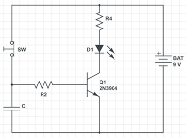
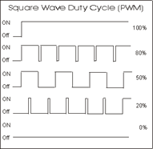
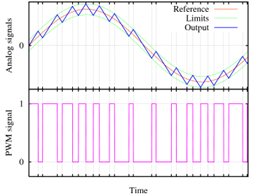
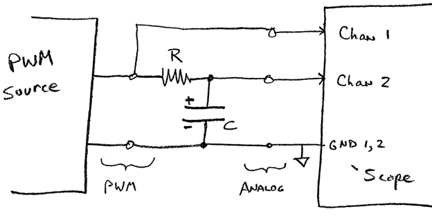

# Introduction

Learning Objectives: students successfully completing this lab will be able to:

- Explain and compute how much electrical energy can be stored in a capacitor
- Explain a simple switching model of a BJT
- Compute current in a forward-biased LED circuit (LED on).
- Build a simple delay circuit with led, switch, battery, resistor and BJT.
- Explain the working principle of a low-pass RC filter circuit by making a voltage divider analogy
- Apply the RC low pass filter to the Pulse Width Modulation (PWM) implementing a Digital-Analog-Converter (DAC)

# Write-Up

The writeup for this lab should contain the following outline:

1. Title page (see Title Page template posted on Canvas Laboratory page)
2. Introduction
   - ⅓ of a page describing the purpose and goals of this lab in your own words. Do not reproduce any material from this assignment document in any section of your writeup.
3. Results
   - Each location in the instructions below marked with ✏️ indicates some data which must appear in your report. Separate each result or related set of results with a section header indicating what it is. For any numerical data or graph describe the meaning of the data.
4. Discussion and Conclusions:
   - In ½ to 1 page, summarize the key learning points from the Results above.

# Pre-lab Requirements

- Review the knowledge of voltage division circuit, RC circuits, and BJTs. See [TECHIN 512 extra resources posted on the Canvas Laboratory page](https://docs.google.com/document/d/1Bf47hfjdwXa7fEtm0arl0bAjzYLDUktPa9syjXYvjqI/edit?usp=sharing).
- Review resistance, capacitance and [impedance](https://en.wikipedia.org/wiki/Electrical_impedance) through Wikipedia or other online resources.

# Parts, tools, supplies required

- DC power supply(9V)
- 1000uF capacitor rated to +10V
- 220 Ohm resistor
- 1000 Ohm resistor
- NPN BJT (2N3904)
- Light emitting diode (LED)
- SPDT switch
- Arduino Uno
- Jumper wires
- Solderless breadboard
- Function generator
- Oscilloscope
- 10X oscilloscope probes
- Handheld multimeter
- Eye protection (for capacitors)

# Assignment

Figure 1: Delay Circuit with BJT. As shown above is the LED lit or not? What happens if you press and hold the button?

## Part 1: Basic LED Circuit

Build the circuit below on a [breadboard](/Lab2/information/breadboard.md) using the values shown in the image. Note: this is a simplification of the circuit in Figure 1. Keep in mind that LEDs are polarized, which means they only work properly when hooked up in the right orientation. The positive side has a longer leg. Sometimes those legs get cut, so you can either try each direction and see what works or look for the flat spot on the plastic lens, which marks the ground (negative) side.

**Note:** your [breadboard](/Lab2/information/breadboard.md) will look different because you will be using jumpers to make the connections rather than small segments of wire used in these images. The small wire segments make it easier to see what things are connected for demonstration purposes. If you would like your board to look similarly neat, [check out this quick tutorial on making your own jumper wires.](https://youtu.be/ver-Av8vr1Q?t=8)

1.1 Check your switch. As shown in the schematic, the switch (SW) will open the circuit when slid to the right position. Does your switch work this way? Use the DMM to find out if it is “press-to-open” or “press-to-close” type switch, or Single Pole Double Throw (SPDT) type switch. If you put your DMM in resistance mode and press the noise button, it will beep whenever two things are electrically connected. Try switching to this mode and touching the probe tips together.

- ✏️ Take a photo of your switch and report what you measured with DMM, and which type of switch you have.

  1.2 Operate your circuit. Repeatedly operate your switch and verify that the LED lights up.

- ✏️ Include a small photo of the lit up LED including the switch position.
- ✏️ [Use DMM to measure two voltages](/Lab1/dmm.md/#measuring-voltage):

  1. ✏️ across the LED
  2. ✏️ across R4

  1.3 [Measure current](/Lab1/dmm.md/#measuring-current). Set your DMM to current mode and change the red wire to “mA/uA”. Open circuit between +9V and R4 and connect DMM.

- ✏️ What is current with switch open and closed. Does LED still light?
- ✏️ Compute R4 current according to measured voltage (step 1.2.1) and its value (220 Ohms or as built).

## Part 2: BJT Circuit

The Bi-polar Junction Transistor (BJT) is a versatile device which we will use as a current-controlled switch. A small current going in to the “base” terminal (to the emitter) controls a bigger current flowing from “collector” to “emitter”.

First we will demonstrate this ability using the switch to change base current input from zero to a small value. This will light the LED. It takes some care to wire up the BJT correctly. Compare the schematic to this diagram to identify the correct pins.

2.1 Build the switching BJT circuit. Wire up exactly as shown in Figure 1 except leave out the capacitor C. Operate the switch - LED should go on and off.

- ✏️ Take a photo of your circuit build.

  2.2 [Measure Currents](/Lab1/dmm.md/#measuring-current). Remember that your multimeter must be placed in series with the component you want to measure current through. This means you will always have to break your circuit to measure current. For both switch positions, measure the current in

- ✏️ R2, the Base circuit
- ✏️ R4, the LED / Collector circuit.
- ✏️ Explain your results in terms of the switching idea described above.

## Part 3: BJT Timer Circuit

3.1 Now add the capacitor C as shown in Figure 1. **Be careful with how you wire the capacitor. Electrolytic capacitors are polarized and may explode if wired backwards.** The white stripe on the side of the capacitor should be on the ground (negative) side of your circuit. Operate the switch.  
 

- ✏️ What happens when you operate the switch?

  3.2 Time responses. Connect both oscilloscope probes ground clips to negative battery voltage (0V). Connect Channel 1 to the capacitor. Connect Channel 2 to the junction of R4 and the LED.

- ✏️ Capture a screenshot of what happens to these two voltages when you close the switch and then open it.
- ✏️ Add a horizontal bar to the screenshot to illustrate when the LED is ON.
- ✏️ Document different observed delay times with at least 3 different capacitors (show three screenshots and give C values). It may take up to several minutes until the LED fully dimmed. If the LED keeps glowing, you can record the time when the voltage across the LED drops 80%.

## Part 4: RC Low-Pass Filter

This part will illustrate a practical application of RC circuits: smoothing out pulse-width-modulation to approximate an analog signal. Many low-cost microcontroller (e.g. Arduino) based embedded systems do not have analog outputs, but we can fake one by rapidly flipping a bit on and off.

Figure 2: Pulse Width Modulation. Several levels of PWM (top). Smoothing out a PWM signal can approximate an analog signal with lower frequencies (bottom).

Pulse width modulation (PWM) is a series of pulses which turn ON at regular time intervals but can stay on for different amounts of time. We express this as a percentage of time that the signal is ON. The percentage of ON time is called the duty cycle. If the duty cycle is high, then more energy is delivered to a load. If we switch ON and OFF quickly, then we can modulate this duty-cycle up and down to approximate an analog output. Please review this [introduction to PWM from Sparkfun](https://learn.sparkfun.com/tutorials/pulse-width-modulation/all) if you are not already familiar with it.

PWM signals have a lot of high frequencies in them due to the switching frequency and also harmonics from the rectangular wave shape. They also have a DC component (0 frequency) which depends only on the ratio of on to off times (duty cycle). We will build a low-pass filter to get rid of the high frequencies and only let through the lowest frequencies to reveal the DC component of the PWM signal.

By “filtering out” the high switching related frequencies, a RC low-pass filter can convert a PWM signal from an Arduino to a “smooth” DC voltage (by filtering out the switching frequency).

Our overall system is shown in Figure 3.

Figure 3. Using an RC circuit to smooth a PWM signal into an analog signal. The **low-pass** RC circuit shown eliminates high frequency changes and only passes through low frequencies.

Procedure:

1. Generate a PWM signal where you can control the duty cycle. For the source of the PWM signal we recommend you use a signal generator with [1.0 kHz frequency](/Lab1/signal_gen.md/#adjusting-frequency), [Vmin of 0.0 V, and Vmax of 3.5 V](/Lab1/signal_gen.md/#adjusting-amplitude).
   - If you would like a challenge, you can use an Arduino with code [at this link](http://forcetronic.blogspot.com/2018/02/converting-arduino-pwm-output-to-dac.html) instead of the signal generator.
2. Design an RC low-pass circuit. Determine a cutoff frequency 10x lower than your PWM switching frequency. Determine your RC time constant based on this frequency ([see this pdf](assets/low_pass_filter_design.pdf)). Set R = 1000 Ohms, determine your **C** value. If exact C value is not available, pick the closest available and
   - ✏️ document changes in circuit design and parameters due to this approximate value. **Remember: capacitors may explode if wired wrong.** Make sure the side of the capacitor with the white stripe is connected to ground.
3. Connect oscilloscope to circuit as shown in Figure 3. Set vertical controls for Channels 1 and 2 to show both waves. Set the time base to show 10 cycles of the PWM input.
   - Connect your ground clip to ground in the circuit.
   - [Set your probes and oscilloscope to 10x](/Lab1/oscope.md/#connecting-probes).
   - [Calibrate your probes](/Lab1/oscope.md/#calibrating-oscilloscope-probes).

Note: Make sure the red and black clips coming from the signal generator do not touch. Touching them will cause a short, which could damage the machine or cause the cables to get hot.

4. Measure input and output for duty cycle of 20%, 60%, 90%
   - ✏️ Capture screen shots of the three duty cycles.
5. Repeat step two, but set the cutoff frequency 100x lower than the PWM frequency. Measure input and output for duty cycle 50%
   - ✏️ What is the wave shape of the output signal (screenshot)?
6. Using this new RC circuit:
   - ✏️ Make a graph of the DC value of the output vs. PWM duty cycle for duty cycle values of {10%, 30%, 50%, 75%,90%}
   - ✏️ Document your circuit design and how you chose the right resistor and capacitor.
   - ✏️ Include a schematic diagram of your circuit design with each component marked with its value.
   - ✏️ One photo of your circuit on the breadboard.

# Frequently Asked Questions

**Q: My circuit connection looks correct, but the LED does not light up as expected.**

A: Unlike normal resistors, LEDs only allow current to flow in one direction, from the longer pin (positive) to the shorter pin (negative). You can simply switch the two pins of LED to see if they are reversed.

**Q: In 3.2, the LED cannot fully dim, but it is also difficult to tell when the voltage drops 80%.**

A: You may need to change the horizontal scale (time) to be larger on your oscilloscope so that it shows a longer time period on the screen which makes observations easier. You can also add a horizontal reference bar by pressing the ‘Cursors’ button and then using the knob to adjust the position.

**Q: In Part 4, the voltage on the signal generator is set to 3.5V, but the voltage on the oscilloscope is larger than 3.5V.**

A: The voltage measurement on the oscilloscope should never exceed signal generator since the filter circuit could not increase the input voltage. If you find that the voltage on oscilloscope is larger, it is highly possible that the ‘load’ setting on signal generator is wrong. Because we are using a 1000 Ohm resistor, the ‘load’ setting should be ‘High Z’, or you can manually set it to 1000 Ohm.

**Q: How were the schematics made?**

A: The schematics were all made using Autodesk Eagle, which is used for designing circuit boards. As students, you have free access to Eagle when you sign up for an Autodesk account.
