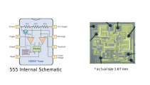
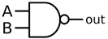
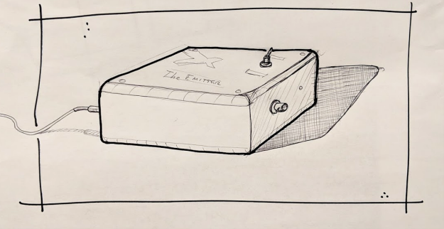
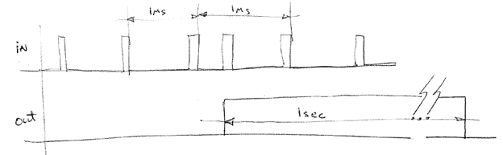
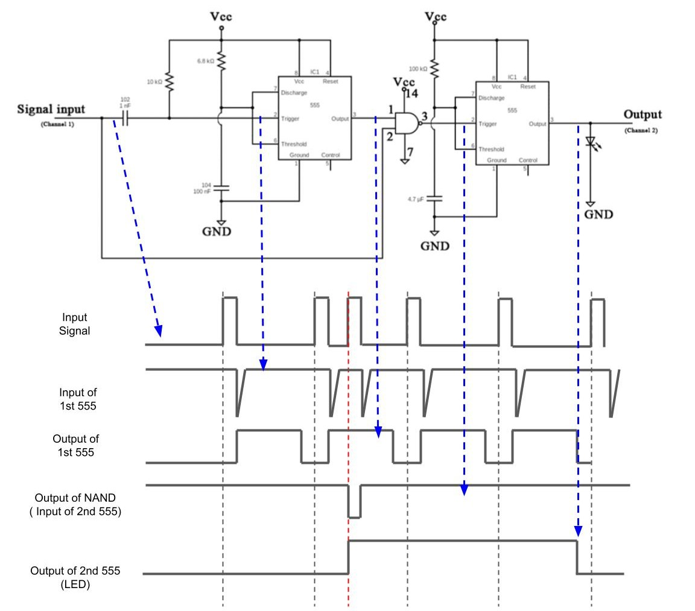
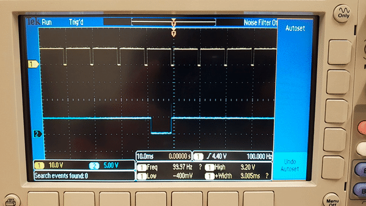

# Introduction
The purpose of this lab is to learn about the many uses of one of the first IC’s to go viral, the 555 timer. This IC from the 1970’s is still in wide use today. Learning about its tricks is a useful analog skill.

# Background

The [555 Timer (click for datasheet)](https://www.ti.com/lit/ds/symlink/ne555.pdf) consists of a voltage divider (three 5k resistors, hence 555) two comparators (triangles), a bi-stable circuit (flip-flop, green box), and a couple of output driving circuits (“Output Driver” and NPN bipolar transistor). The [555](https://en.wikipedia.org/wiki/555_timer_IC) has been produced for decades by many companies. These parts function as follows:
- Comparator: Output logic 1 if input “+” is greater than input “-”, otherwise output logic 0.
- Flip-Flop: A momentary pulse on the “Set” input, S, sets output Q = 1, Q(bar) = 0. A pulse on the “Reset” input R, sets Q=0. If both S and R are 0, the output keeps its state from the most recent input pulse. If  both S and R are 1, the output is undefined. A Flip-flop can be thought of as a 1-bit memory.
- Output Driver: supports up to about 100Ma output current in most conditions (see datasheet).

References: [Teardown of a 555 (with interactive die photo)](http://www.righto.com/2016/02/555-timer-teardown-inside-worlds-most.html)

# Write-Up

The writeup for this lab should contain the following outline:
1. Title page (see template in the folder ‘Requirement of Lab Reports’)
2. Introduction
⅓ of a page describing the purpose and goals of this lab in your own words. Do not reproduce any material from this assignment document in any section of your writeup.
3. Results
Each location in the instructions below marked with “✏️” indicates some data which must appear in your report. Separate each result or related set of results with a sub-section header indicating what it is. For any numerical data or graph describe the meaning of the data. Always label and describe the X and Y axis of any graph. When comparing two graphs, always plot them with the same X and Y axis limits.
4.	Discussion and Conclusions
- In ½ to 1 page, summarize the key learning points from the Results above.

# Preparation

## Pre-lab computations
- Study the [555 Wikipedia Page](https://en.wikipedia.org/wiki/555_timer_IC). Referring to the section on [“Monostable mode,”](https://en.wikipedia.org/wiki/555_timer_IC#Monostable) compute R (Assume C = 0.1uF) for an output pulse width of 1.0 milliseconds (10-3 sec).
- Referring to the section on [“Astable mode,”](https://en.wikipedia.org/wiki/555_timer_IC#Astable) compute values of R1 to achieve a frequency, f = 100k Hz, duty 52.8%. Assume C = 100pF, R2 = 68 kΩ.

- Review the definition of a two-input NAND gate:

| A | B | A **NAND** B |
| :---: | :---: | :---: |
| 0 | 0 | 1 |
| 0 | 1 | 1 |
| 1 | 0 | 1 |
| 1 | 1 | 0 |
- Note that a NAND gate can also be an inverter: connect the two inputs together (A=B). Now: OUT = NOT INPUT

The above should be completed before the scheduled lab start time.  

Parts:
- 555 timer in 8-pin DIP package
- 74HC00 Quad NAND Gate
- Jumper wires
- Resistors and capacitors

# Assignment

## Monostable Mode

Wire your 555 up in Monostable mode ([Wikipedia reference](https://en.wikipedia.org/wiki/555_timer_IC#Monostable)). Use the R and C values from your pre-lab computations. If you need a refresher on breadboards, [review this article here.](/Lab2/information/breadboard.md)

**Note:** These images do not show connections to the power supply and signal generator. The power line should be connected to a power supply in a similar style to previous labs, the grounds should all be tied together (power supply, signal generator, and circuit), and the signal generator should be attached at the points described below.

1. With Vcc connected to +5V on a power supply, connect “Output” (555 pin 3, see diagram at the top of the page) to your oscilloscope and clip the probe ground to ground.
1. Set the signal generator to a frequency of 100Hz. Set high level to 4.5 V and low level to 0.1 V. Pulses should be "high" (5 V) for most of the time and "low" (0-0.2 V) for 10 microsecond (us). Refer back to the [Lab 1 references](/Lab1/signal_gen.md) if you need a refresher on the signal generator.
1. Connect pulse output from signal generator to “Trigger” on your 555 (555 pin 2, see diagram at the top of the page).
1. Connect a second oscilloscope channel/probe to Trigger (555 pin 2, see diagram at the top of the page).
1. ✏️ Capture an oscilloscope picture showing 3-4 cycles of the input and output pulses.
1. ✏️ Comment on pulse duration of the output pulse compared to calculations and measured R value.

## Astable Mode

Wire your 555 up in Astable mode ([Wikipedia reference](https://en.wikipedia.org/wiki/555_timer_IC#Astable)). Use the R and C values from your pre-lab computations.

**Note:** The power line should be connected to a power supply in a similar style to previous labs, the grounds should all be tied together (power supply, and circuit).

1. ✏️ Measure the exact resistance values you used for R1 and R2. Connect the components identified in your pre-lab computations.
1. ✏️ Measure the frequency of the output signal. How does it compare with calculations and measured R values?
1. ✏️ Measure duration of each pulse. How does it compare with calculations and measured R values?

## Extra Pulse Detector (second week)

The task is to design a pulse generator checker. “GIX industries LLC” has developed a pulse emission device, “The Emitter” which emits a continuous stream of pulses. Each pulse is ~10 microseconds and they occur at 1000 pulses per second. When the product is defective it produces an additional pulse, in between two normal pulses, but it does this very infrequently, about once every 2-3 seconds.

You can build you own ‘Emitter’ using an Arduino. [See the files here for more details.](emitter)

Problem definition:

Reference: [555 Extra Pulse Catcher](555_extra_pulse_catcher.docx)

Design a circuit combining two 555 chips and a 74HC00 quad NAND gate to perform the following function:
1. Create the emitter using the [instructions in this document.](emitter/how_to_build_extra_pulse_emitter.docx)
1. Provide an output LED which is normally OFF.
1. If in any 1ms period, more than one pulse comes into the input of your circuit, light the LED for 1 second. This functionality is illustrated below:

1. Build the [555 Extra Pulse Catcher](555_extra_pulse_catcher.docx) using your [breadboard](/Lab2/information/breadboard.md).
   1. Connections to GND use black wires.
   2. Connections to Vcc use red wires.
   3. Connections to 3.3V use orange wires.
   4. Connections to >5V use yellow wires.
   5. General inputs use white and grey wires.
   6. Data signals use green wires.
   7. Output signals use blue wires.
1. Tests:
    1. ✏️ Using “The Emitter” device, validate function of your circuit and ask a TA to check.
	1. ✏️ With “The Emitter” connected, connect both “IN” and “OUT/LED” of your circuit to the oscilloscope. Trigger on the rising edge of “OUT/LED” and capture both signals in a screen shot. ✏️ Describe how these signals validate the correct operation of your circuit.
	**Notice that Vcc should be 3.5V ~ 4.2V instead of 5V**

This is how the extra pulse catcher circuit works:

Correct circuit operation:

How to set trigger on Oscope:

# Frequently Asked Questions

**Q: In monostable mode, the circuit connection is correct but the output is not as expected.**

A: Please notice that the pulse duration is 10 microseconds, which is actually 10 us, NOT 10 ms (millisecond).

**Q: The oscilloscope is connected to the “output” and “trigger”, but the signal on the screen seems wrong and unstable.**

A: Please check if the ‘GND’ of the probe is connected to the same ground of the 555 timer, instead of the ‘GND’ on the oscilloscope device (this ‘GND’ is usually only used when calibrating the probe).

**Q: I finished monostable mode and work on astable mode, I think the circuit and resistors are correct, but the output is wrong.**

A: Please double-check if the signal generator is still connected to the circuit. In astable mode, Pin 2 ‘Trigger’ should be connected between R2 and C, the same as Pin 6, instead of the signal generator.

**Q: The extra pulse catcher circuit does not work well. How could I debug it?**

A: First, it is easiest to check all the resistors and capacitors. You can use DMM to measure the resistance. For capacitance, please refer to this “How to read capacitor code”. Next, please double-check that all the chips are powered (Vcc and GND connected, and the voltage is 4.5V). Finally, it takes some time to check the wiring. There are many ways to do it. What I usually do is to take a look at one pin or node in the diagram and remember what is connected to this pin or node. Then go to the circuit to check it. Repeat this procedure for all the pins and nodes.

**Q: Why is the diagram of the pins for the 555 different from the schematic symbol?**

A: Schematic symbols are used when diagramming a larger circuit, so they often prioritize a format that shows the flow of information in a circuit. For example: pins that are most often inputs are often on the left of the schematic symbol while outputs are often on the right. This convention makes it easier to see how a circuit works from a schematic, with information flowing generally from the left side to the right side. Keep this in mind when you eventually make your own schematic symbols for your own circuit boards as it will make debugging the circuit much simpler.

The physical pins, however, are often constrained by how the circuitry on the silicon die is laid out, so often inputs and outputs are mixed on either side of the integrated circuit (IC).

**Q: In monostable mode, why am I getting an output signal that looks like this?**

A: Check whether your power supply is on (On/Off button should be glowing). It should also be connected to the appropriate pins on the breadboard.

**Q: In monostable mode, the output pulse seems unstable and looks like the gif below. Why is it unstable?**

 
 A: The output pulse is too long, which means it misses several trigger pulses from the signal generator and triggers whenever the next pulse occurs. This can be solved by configuring your R and C values to get an appropriate output pulse width. See the [Wikipedia reference](https://en.wikipedia.org/wiki/555_timer_IC#Monostable).
