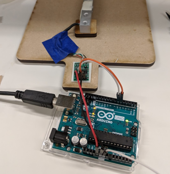

# Strain Gage / Load Cell

## Introduction
The purpose of this lab is to learn about measurement of Force and Strain. We will learn about ideal and non-ideal behavior of practical force sensors. Measuring force is frequently used to measure weight.

### Key Terms and Equations
- **Strain**: Deformation of a material normalized by the starting length.
	- `Strain = 𝜺 = ΔL/L`
	- The units (mm, inch etc) cancel out. Strain is unitless, but you will sometimes see it listed as in/in or mm/mm.

- **Stress**: Force per unit area.
	- `Stress = σ = F/A`
	- Units of stress are Pascals or pounds-per-square-inch, PSI

Under some conditions, strain is proportional to stress by this simple equation, known as Hooke's Law:

`ϵ = Eσ`

E is Young’s modulus and is a material property. Most force/weight sensors measure change in resistance due to strain, which is then converted to a stress based on the Young's modulus of the load cell. If the stress or strain is too big, the material might crack or deform, breaking this relationship. The stress is then converted to force based on the geometry of the load cell. 

### Sensors for Measuring Force
**Strain Gage**: A sensor which can measure small changes in length on a surface. As the gage is stretched, its resistance will change.

**Load Cell**: A structure which has a linear relationship between stress and strain so that it follows Hooke’s Law. A strain gage is applied to the surface of a load cell. The geometry of the load cell is what makes it work effectively. They are designed to deform mostly in one area, where the strain gage is placed. This also means that they are delicate.

### Resistive Heating
We have from Ohm’s Law: V=IR. We also know that power is: P=IV. From this we can easily get P=I2R. Power in a resistor converts directly to heat and heat converts to temperature. Thus any resistor will heat up more and more as power is increased. Strain gages are resistors. One thing we will study in this lab is how strain gages respond to changes in temperature.

### Further Reading
- [Background](background.pdf): This material (From Prof. Hannaford’s EE543 course notes) goes into more depth and detail on load cell design.
- [Sparkfun Tutorial](https://learn.sparkfun.com/tutorials/load-cell-amplifier-hx711-breakout-hookup-guide/all): Detailed info on hooking up a brid(ge-based load cell to Arduino
- [Instructables Tutorial](https://www.instructables.com/Arduino-Scale-With-5kg-Load-Cell-and-HX711-Amplifi/): Similar tutorial.

## Preparation
### Pre-lab Computations
- None but see Computer Preparation below

### Computer Preparation
- Make sure your laptop can do Arduino development (one such laptop per lab bench team).
- Install the HX711 chip library [using the instructions here](https://www.arduino.cc/reference/en/libraries/hx711-arduino-library/)

### Parts, Tools, and Supplies

- Strain gage
- “Diving Board” load cell
- Platform load cell
- Test weight set
- Benchtop DMM
- Fluke DMM with Type K thermocouple plug
- Power supply
- Cup of ice cubes 
- Heat gun 
- Soldering iron
- Arduino
- USB cable
- [Arduino code](src/scale_reader/scale_reader.ino)
- [HX711 chip Arduino driver](https://www.arduino.cc/reference/en/libraries/hx711-arduino-library/)

## Procedure:

### Strain Gage Measurements
In this section you will study the resistance of the individual strain gage and its sensitivity to temperature.

1. Resistance temperature sensitivity. We will use the resistance of the strain gage to heat it up a little bit and then see how much the resistance changes.
	1. Set power supply to 2.0V and current limit to about 200mA.
	1. Set up the bench-top DMM (not the Fluke yellow handheld DMMs, which we will need later to measure temperature) to measure current. Using “LO” and “mA” inputs, connect it in series with the strain gage and the power supply.
	1. Using the button labeled “Rate”, set the Bench-DMM to “slow” -- this means it will average several readings to get more accuracy (5 ½ digits). Record all 5 digits from the DMM in “slow” mode. If the last digit is flickering between two values, split the difference. For example: 1.4297{3 / 4} becomes 1.429735.
	1. Read current from the DMM.
	1. ✏️ What is the voltage, V (assume the power supply is accurate), and current, I? 
	1. ✏️ Compute the resistance using Ohm's Law V=IR. 
	1. ✏️ What is the power dissipated in the strain gage? (P = IV or P=I2R).
	1. Change power supply voltage to +5V Wait for 3 minutes. 
	1. Measure/compute R = V/I. 
	1. ✏️ What is the resistance? 
	1. ✏️ Did it change?
	1. ✏️ Compute the power dissipated in the strain gage resistance
	1. Reduce voltage to 1.0V. Wait 3 minutes. During this time, predict the current using both values of resistance.
	1. ✏️ Record current and compute resistance after 3 min of cooling.
1. Delta-R vs cold (ice cube) In this section, we will study how resistance of the gage changes with temperature.
	1. Place the strain gage (not the diving board) on several sheets of paper or a notebook (thermal insulation from the desk).
	1. Set power supply to 1.0 V, ✏️ measure current / compute resistance.
	1. Apply an ice cube to the gage. Use a plastic bag or some other methods to apply ice, in order to prevent direct contact. Water may affect measurement. ✏️ What is change in resistance?
	1. Use temperature attachment (type “K” thermocouple) with yellow Fluke DMM to ✏️ measure room temperature. Then, ✏️ press your finger on the tip of the thermocouple and record temperature.
	1. Assume the ice is approximately 0 deg C. Cycle the gage 5 times between 0C and room temperature. ✏️ Record resistance at each temperature for each cycle. Average your results at each temperature.
	1. ✏️ Compute coefficient of thermal resistivity: G = ΔR/ΔT

### “Diving Board” Load Cell
The diving board is a load cell with a single strain gage. We’ll measure its sensitivity to strain and temperature. The strain gage is the same type (nominal resistance 350 Ohm) but it is glued to a beam of acrylic material.

1. Hook up the diving board leads to the bench-top DMM the same way as in part 1. Set the DMM to “slow” for maximum accuracy. Using 2.0V from the power supply, ✏️ Compute and record the resistance.
1. Stretch the gage by gently pressing down on the end of the diving board until it touches the base. ✏️ Compute and record resistance when gage is deflected.
1. Release the “diving board”
1. Set heat gun switch to “Low” and verify that it is blowing room temperature air.
1. Blow room temperature air on the “diving board” strain gage for 1 min. ✏️ Compute and record resistance without touching the gage.
1. Tape Type K thermocouple onto diving board near the strain gage (leave tip out in open air just above strain gage).
1. Set the heat-gun to high. From a distance of 12” (50cm), heat the strain gage with the heat gun for 15 seconds (**DO NOT APPLY HEAT CLOSER THAN 12” / 30cm or you WILL damage the strain gage.**) ✏️ Record hot air temperature with DMM.
1. ✏️ Compute and record resistance when gage is heated (but not pushed or deformed).

### Load Cell Measurements ### 
Finally we will study a weight measurement system consisting of a load cell mounted between two platforms. The setup below is shown without the top plate for clarity.

1. Plug an Arduino into your prepared laptop.
1. Using male-to-female jumper wires, connect Arduino with load cell HX711 chip via SPI with the following wiring:
	1. Arduino pin 6 to HX711 SCK
	1. Arduino pin 5 to HX711 DT
	1. Arduino pin 5V to HX711 VCC
	1. Arduino pin GND to HX711 GND
1. Download and run [pre-written sketch](scale_driver.ino) which can:
	1. Read load cell, type sensor reading on Laptop Screen (terminal)
	1. Repeat
1. Calibrate the load cell with weight set:
	1. Apply 1g, 10g, 100g to the center target on the TOP platform.
	1. ✏️ Record load cell reading at each weight. Use each weight 3 times and average the results.
	1. ✏️ Using a spreadsheet, or graph paper, fit a linear equation to your calibration data and add it to the Arduino sketch so that the Arduino prints grams on your laptop.
	1. ✏️ Record calibrated reading for each weight. Verify your calibration.
	1. Apply the 100g weight to each target on the top platform in turn. ✏️ What is the variation in weight measured due to location??
### Temperature Sensitivity ###
1. Place a weight between 100-500 grams on your platform. ✏️ Record the weight reading at room temperature.
1. Place the type K thermocouple tip inside the two holes in the load cell beam.
1. Set the heat-gun to high. From a distance of 12” (50cm), heat the strain gage with the heat gun for 15 seconds (**DO NOT APPLY HEAT CLOSER THAN 12” / 30cm or you WILL damage the strain gage.**) ✏️ Record hot air temperature from Fluke DMM.
1. ✏️ Record the weight reading and air temperature.
1. ✏️ Remove heat gun. ✏️ How long does it take for the weight reading to return to within 1% of the room temperature weight? 
	1. Some of the strain gauges’ readings may not return to 1%. In this case, wait until the reading is stable and record the stable value.

## Write-Up
Same instructions as previous TECHIN 512 labs

## Frequently Asked Questions
**Q: When measuring the current on the strain gage, the value is very small and results in a large resistance.**

A: Please check if the thin wires of the strain gage have insulating coating. If it is yellow, it means that the insulating coating is not removed. Please find another strain gage or you can use the diving board which contains a stain gage and is ready to be measured.

**Q: How do I calibrate the load cell?**

A: There are many different ways to calibrate sensors. We use basic linear regression in this lab. The goal is to find the relationship ‘y = ax + b’ where ‘x’ is the raw value of your sensor, ‘y’ is the calibrated output (during calibration, it is also called ground truth), ‘a’ is usually called scale, and ‘b’ is usually called ‘bias’. After measuring 1g, 10g, and 100g, you now have 3 pairs of (x, y). There are many ways to do linear regression. You can do it manually, use Excel, search for online websites, or write a script.
