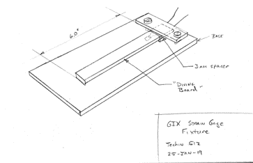

# Strain Gauge / Load Cell

## Introduction
The purpose of this lab is to learn about measurement of Force and Strain. We will learn about ideal and non-ideal behavior of practical force sensors. Measuring force is frequently used to measure weight.

### Key Terms and Equations
- **Strain**: Deformation of a material normalized by the starting length.
	- `Strain = 𝜺 = ΔL/L`
	- The units (mm, inch etc) cancel out. Strain is unitless, but you will sometimes see it listed as in/in or mm/mm.

- **Stress**: Force per unit area.
	- `Stress = σ = F/A`
	- Units of stress are Pascals or pounds-per-square-inch, PSI

Under some conditions, strain is proportional to stress by this simple equation, known as Hooke's Law:

`ϵ = Eσ`

E is Young’s modulus and is a material property. Most force/weight sensors measure change in resistance due to strain, which is then converted to a stress based on the Young's modulus of the load cell. If the stress or strain is too big, the material might crack or deform, breaking this relationship. The stress is then converted to force based on the geometry of the load cell. 

### Sensors for Measuring Force
**Strain gauge**: A sensor which can measure small changes in length on a surface. As the gauge is stretched, its resistance will change.

**Load Cell**: A structure which has a linear relationship between stress and strain so that it follows Hooke’s Law. A strain gauge is applied to the surface of a load cell. The geometry of the load cell is what makes it work effectively. They are designed to deform mostly in one area, where the strain gauge is placed. This also means that they are delicate.

### Resistive Heating
We have from Ohm’s Law: V=IR. We also know that power is: P=IV. From this we can easily get P=I2R. Power in a resistor converts directly to heat and heat converts to temperature. Thus any resistor will heat up more and more as power is increased. Strain gauges are resistors. One thing we will study in this lab is how strain gauges respond to changes in temperature.

### Further Reading
- [Background](background.pdf): This material (From Prof. Hannaford’s EE543 course notes) goes into more depth and detail on load cell design.
- [Sparkfun Tutorial](https://learn.sparkfun.com/tutorials/load-cell-amplifier-hx711-breakout-hookup-guide/all): Detailed info on hooking up a brid(ge-based load cell to Arduino
- [Instructables Tutorial](https://www.instructables.com/Arduino-Scale-With-5kg-Load-Cell-and-HX711-Amplifi/): Similar tutorial.

## Preparation

### Parts, Tools, and Supplies

- Strain gauge
- “Diving Board” load cell
- Platform load cell
- Test weight set
- Benchtop DMM
- Fluke DMM with Type K thermocouple plug
- Power supply
- Cup of ice cubes 
- Heat gun 
- USB cable

## Procedure:

### Strain Gauge Measurements
In this section, you will study the resistance of the individual strain gauge and its sensitivity to temperature. (You can use the 'diving board', which makes measurements easier, instead of a single strain gauge.)

1. **Testing resistance temperature sensitivity:** We will use the resistance of the strain gauge to heat it up a little bit and then see how much the resistance changes.
	1. Set the power supply to 2.0V and current limit to about 150mA.
	1. Set up the bench-top DMM (not the Fluke yellow handheld DMMs, which we will need later to measure temperature) to measure current. Using “LO” and “mA” inputs, connect it in series with the strain gauge and the power supply.
	1. Using the button labeled “Rate”, set the Bench-DMM to “slow” -- this means it will average several readings to get more accuracy (5 ½ digits). Record all 5 digits from the DMM in “slow” mode. If the last digit is flickering between two values, take the average of the two. For example, if the DMM switches between 1.42973 and 1.42974, the average of the two is 1.429735.
	1. ✏️Record the current from the DMM.
	1. ✏️ Compute the resistance using Ohm's Law. 
	1. ✏️ What is the power dissipated in the strain gauge? (P = IV or P=I2R).
	1. Change power supply voltage to +5V Wait for 3 minutes. 
	1. ✏️Record the current and compute the resistance with the new voltage. 
	1. ✏️ Did the resistance change?
	1. ✏️ Compute the power dissipated in the strain gauge resistance
	1. Reduce voltage to 1.0V. Wait 3 minutes. During this time, predict the current using both values of resistance.
	1. ✏️ Record current and compute resistance after 3 min of waiting above.
1. **Delta-R vs cold (ice cube):** In this section, we will study how the resistance of the gauge changes with temperature.
	1. Place the strain gauge on several sheets of paper or a notebook (thermal insulation from the desk).
	1. Set power supply to 1.0 V, ✏️ measure current / compute resistance.
	1. Apply an ice cube to the gauge. Use a plastic bag or some other method to apply ice, in order to prevent direct contact. Water may affect the measurement. ✏️ What is change in resistance?
	1. Use temperature attachment (type “K” thermocouple) with yellow Fluke DMM to ✏️ measure room temperature. Then, ✏️ press your finger on the tip of the thermocouple and record the temperature.
	1. Assume the ice is approximately 0 deg C. Cycle the gauge 5 times between 0C and room temperature. ✏️ Record resistance at each temperature for each cycle. Average your results at each temperature.
	1. ✏️ Compute coefficient of thermal resistivity: G = ΔR/ΔT

### “Diving Board” Load Cell
The diving board is a load cell with a single strain gauge. We’ll measure its sensitivity to strain and temperature. The strain gauge is the same type (nominal resistance 350 Ohm) but it is glued to a beam of acrylic material.

1. Hook up the diving board leads to the bench-top DMM the same way as in part 1. Set the DMM to “slow” for maximum accuracy. Using 2.0V from the power supply, ✏️ Compute and record the resistance.
1. Stretch the gauge by gently pressing down on the end of the diving board until it touches the base. ✏️ Compute and record resistance when gauge is deflected.
1. Release the “diving board”
1. Set heat gun switch to “Low” and verify that it is blowing room temperature air.
1. Blow room temperature air on the “diving board” strain gauge for 1 min. ✏️ Compute and record resistance without touching the gauge.
1. Tape Type K thermocouple onto diving board near the strain gauge (leave tip out in open air just above strain gauge).
1. Set the heat-gun to high. From a distance of 12” (50cm), heat the strain gauge with the heat gun for 15 seconds (**DO NOT APPLY HEAT CLOSER THAN 12” / 30cm or you WILL damage the strain gauge.**) ✏️ Record hot air temperature with DMM.
1. ✏️ Compute and record resistance when the gauge is heated (but not pushed or deformed).

### Load Cell Measurements ### 
Finally, we will study a weight measurement system consisting of a load cell mounted between two platforms. You can do either the Micropython or Arduino setup to complete the next section.  

#### ESP32 Circuitpython Setup
1. Plug an ESP32 into your laptop
1. Use jumper cables to connect the HX711 to your ESP32 with the following wiring (You will need to change the main script to make sure it is using the same pin numbers as the ones you select):
	1. HX711 SCK to any digital pin on the ESP32
	1. HX711 DT (Data) to any digital pin on the ESP32
	1. HX711 VCC to ESP32 3V pin
	1. HX711 GND to ESP32 GND
1. Download the [pre-written script](src/CircuitPython/code.py) and associated packages in the same folder.
	1. The HX711 Adafruit Library has been pre-installed on to your ESP32s. Code.py and LLS.py have also been put on your ESP32s.
	1. Read through the code.py script to get a basic understanding of how it works. **The script will prompt you for information on how many data points and weights in the shell/terminal.**
1. Run code.py in Thonny which does the following:
	1. Prompts users to enter number of data points to collect per weight for linear regression. Take at least 25 readings per weight, the more readings you take the more accurate the calibration will be
	1. Prompts users to add weight to scale and collects raw data readings. This repeats for any number of weights you want to collect raw data for (Use at least 0g, 10g, 50g, and 100g)
	1. Performs [linear regression](https://en.wikipedia.org/wiki/Linear_regression) using the [Linear Least Squares](https://en.wikipedia.org/wiki/Linear_least_squares) algorithm on the data collected
	1. Runs an infinite loop that prints calibrated data (in grams) to the console
1. If you find that the readings from Linear Regression using OLS(Ordinary Least Squares) aren't accurate, you can instead use the Least Squares Regression that implements Huber Loss ([LLShuber.py](src/CircuitPython/LLShuber.py)) in the src folder of this lab.
1. ✏️ What you need to collect for your write up:
	1. ✏️ From the script determine what data structure and variable name the data points are being stored into
	1. ✏️ For each weight used to collect data, use indexing to show at least three data points collected and take a screenshot(s)
	1. ✏️ Linear Regression aims to find the relation 'y = mx + b' where m is sometimes called the scale or weight and b is called the bias. From the script find the values of m and b that were calculated from the data.
	1. ✏️ From the script determine the data structure and variable names of the input data to perform linear regression
	1. ✏️ Record calibrated data readings for each weight used to collect raw data readings (For example if you used 10g as part of your calibration process, put 10g on the load cell and record the output post calibration. How close is the calibrated reading to the actual weight?)
	1. ✏️ Apply the 100g weight to each target on the top platform. What is the variation in measured weight due to location?

### Temperature Sensitivity ###
Once you have ran code.py once you do not need to run it again (it will make you go through the calibration process) to get calibrated data readings. You can get calibrated data readings by using the m and b values you recorded or by using the code in the infinite while loop at the bottom of code.py
1. Place a weight between 100-500 grams on your platform. ✏️ Record the weight reading at room temperature.
1. Place the type K thermocouple tip inside the two holes in the load cell beam.
1. Set the heat-gun to high. From a distance of 12” (50cm), heat the strain gauge with the heat gun for 15 seconds (**DO NOT APPLY HEAT CLOSER THAN 12” / 30cm or you WILL damage the strain gauge.**) 
1. ✏️ Record the weight reading and hot air temperature.
1. ✏️ Remove heat gun. ✏️ How long does it take for the weight reading to return to within 1% of the room temperature weight? 
	1. Some of the strain gauges’ readings may not return to 1%. In this case, wait until the reading is stable and record the stable value.

## Write-Up
Same instructions as previous TECHIN 512 labs

## Frequently Asked Questions
**Q: When measuring the current on the strain gauge, the value is very small and results in a large resistance.**

A: Please check if the thin wires of the strain gauge have an insulating coating. If it is yellow, it means that the insulating coating is not removed. Please find another strain gauge or you can use the diving board which contains a stain gauge and is ready to be measured.

**Q: How do I calibrate the load cell?**

A: There are many different ways to calibrate sensors. We use basic linear regression in this lab. The goal is to find the relationship ‘y = ax + b’ where ‘x’ is the raw value of your sensor, ‘y’ is the calibrated output (during calibration, it is also called ground truth), ‘a’ is usually called scale, and ‘b’ is usually called ‘bias’. After measuring 1g, 10g, and 100g, you now have 3 pairs of (x, y). There are many ways to do linear regression. You can do it manually, use Excel, search for online websites, or write a script.
