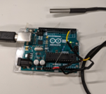
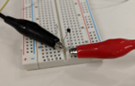

# Introduction

The purpose of this lab is to learn about several of the ways to sense temperature.

# Background

- [Thermocouple](https://en.wikipedia.org/wiki/Thermocouple)

- [What is the effect of temperature on semiconductor diode](https://www.quora.com/What-is-the-effect-of-temperature-on-semiconductor-diode)

- [Thermistor](https://en.wikipedia.org/wiki/Thermistor)

- [Adafruit Feather nRF52840 Sense](https://www.adafruit.com/product/4516)

- [Overview of Adafruit Feather Sense\*\*](https://learn.adafruit.com/adafruit-feather-sense)

# Resources

## One-Wire

- [**One-Wire to Arduino Interfacing**](https://www.tweaking4all.com/hardware/arduino/arduino-ds18b20-temperature-sensor/)
- [**One-Wire Arduino Library**](https://www.pjrc.com/teensy/td_libs_OneWire.html)
- [**1-Wire Tutorial**](https://www.hacktronics.com/tutorials/arduino-1-wire-tutorial.html)

# Write-Up

The writeup for this lab should contain the following outline:

1. Title page (see template in the folder ‘Requirement of Lab Reports’)
1. Introduction
   ⅓ of a page describing the purpose and goals of this lab in your own words. Do not reproduce any material from this assignment document in any section of your writeup.
1. Results
   Each location in the instructions below marked with “✏️” indicates some data which must appear in your report.

# Pre-lab computations:

Compute all resistor values for step 2 below.

## Parts, tools, supplies required

- Dallas Semi "One-Wire" temperature sensor
- Type K thermocouple with Max6675 thermocouple amplifier/SPI interface breakout
- MF52 10KOhm thermistor
- Diode
- Ice-water
- Boiling water
- Heat gun

# Procedure

1. A lab station will be set up with the water baths. Please coordinate with other groups for their use.
1. Referring to the Resources and your pre-lab calculations above, interface each device to the either an Arduino or DMM as follows:

## One-Wire Sensor

1. We have two types of one-wire sensors: stainless steel cylinder, or BJT package. Use appropriate hookup as shown above.
1. Hook up to Arduino, install and run driver software (see Resources above).
1. Using the library manager in the Arduino IDE, install the OneWire library by Paul Stoffregen (Tools \> Manage Libraries \> Search: OneWire). 
1. Open the example sketch that came with the library (File \> Examples \> OneWire \> DS18x20_Temperature)
1. As you get each sensor working, take each one to the ice-water and boiling-water baths.
1. ✏️ Record reading of the sensor in ice water & boiled water.
1. ✏️ Using the fact that ice-water is very close to 0 deg C and boiling water is very close to 100C, derive 2nd order polynomial calibration factors for thermistor. (If you find your type-K sensor or one-wire sensor is also not very accurate, you can also perform calibration. In this case, a linear calibration is often good enough)

## Thermistor:

1. Attach Fluke DMM to thermistor with alligator clips
1. ✏️ Using water baths, record resistance at 
    - ✏️ Room temperature 
    - ✏️ 0&deg;C 
    - ✏️ 100&deg;C
1. The Arduino analog input can handle input voltages from 0-5V. Design a DC circuit making a voltage divider with
    - 5V input (from 5V pin on arduino)
    - A resistor R
    - The thermistor
    - So that the voltage across the 10K-thermistor voltage will range from 0-5V for any temperature from -10&deg;C to + 110&deg;C.
1.  You should **NOT** expect a straight line relationship. 
    - ✏️ Try to fit a 2nd order polynomial (y = ax^2 + bx + c) (or T = a*log(R)+b) to three data points: 0&deg;C, Room Temp, 100&deg;C (where y is resistance and x is temperature).
1.  Write an Arduino sketch which reads the analog port and prints the reading.
    - ✏️ Demonstrate that it works using the water baths.
1. For two points extra credit:
    - ✏️ Implement the polynomial equation on the Arduino
    - ✏️ Demo correct temperature readout
1. ✏️ Record reading of the sensor in ice water & boiled water.

## Adafruit Feather nRF52840 Sense:

Now you have some familiarity with temperature sensors. Let's use a hardware board to get large data sets and do analysis.

1. Set up environment:
    - Install nRF52840 board manager: [install](https://learn.adafruit.com/adafruit-feather-sense/arduino-support-setup)
    - Add the following libraries to the Arduino IDE:
        - Adafruit_BMP280
        - Adafruit_LSM6DS
        - Adafruit_SHT31
        - Adafruit_APDS9960
    - Install Python serial port module: `pip3 install pyserial`
    - Google Colab [open](https://colab.research.google.com/)
1. Upload the [SensorController](https://github.com/adafruit/Adafruit_Learning_System_Guides/blob/main/Adafruit_Feather_Sense/feather_sense_sensor_demo/feather_sense_sensor_demo.ino) to **nRF52840**, you will see reading of the temperature sensor on the board, the data will be printed around every 0.5 seconds.
    
1. Uncomment **Serial.print** command from line 68-95. Take a screenshot of reading from all sensors on the board.
1. **Close the Serial Monitor in Arduino studio** and run [logging.py](src/logging.py). The software will create a csv file to logs/{currentTime}.csv and you can stop it by CTRL+C
    
1. Create a Colab or run [lab6.ipynb](adafruit_nRF52840_Sense/Tech512-Lab6Part3-52840/lab6.ipynb) with Jupyter. You can upload the csv file by drag and drop to the file menu.
    
1. ✏️ Plot the temperature data with time
1. ✏️ Open-ended question: Capture the data for more than 1 minute. Choose the data you are interested in, plot the graph, do analyze: what do you get from the data?
    1. Hints
        1. You can collect accelerometer data and measure the number of steps the user takes within one minute
        1. You can breathe towards the nRF52840 board and get your breath temperature, breath humidity, and change in air pressure.
        1. Analyze the levels of sound in different room or different machine (the sound of 3D printer VS the sound of laser cutter)
