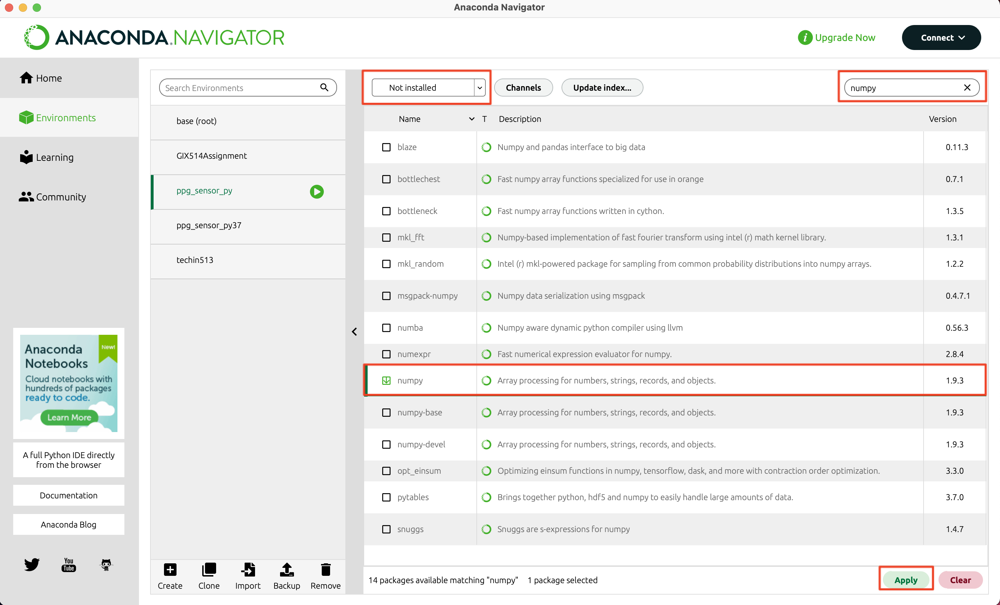
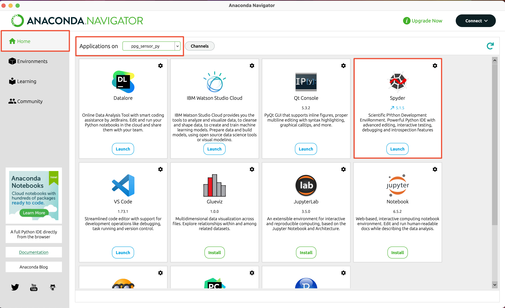

### TECHIN 512 Pulse Oximeter

# Introduction

The purpose of this lab is to learn about measurement of photoplethysmogram (PPG) using pulse oximeter. We will learn about driving a pulse oximeter using Arduino, and using Python serial reader to receive the signal at PC. We will also use filters to reduce the noise and study the affect of the filters on the signal.

# Background

1. A photoplethysmogram (PPG) is an optically obtained plethysmogram that can be used to detect blood volume changes in the microvascular bed of tissue. A PPG is often obtained by using a pulse oximeter which illuminates the skin and measures changes in light absorption. A conventional pulse oximeter monitors the perfusion of blood to the dermis and subcutaneous tissue of the skin

   For more details, please see [Wikipedia – Photoplethysmogram](<https://en.wikipedia.org/wiki/Photoplethysmogram#:~:text=A%20photoplethysmogram%20(PPG)%20is%20an,measures%20changes%20in%20light%20absorption.>).

2. Low pass filters due to non-ideal performance of the sensor system, measurement from sensors usually contain noises. Low pass filters can help with reducing the noise in the signals of sensors. Low pass filters can exist in different forms. For hardware side, as introduced in Lab 3, an RC circuit can be used as a low pass filter when output is connected to the capacitor. In this lab, we will look at the software side where filters are applied by code and algorithms.

3. Moving average filter is applied by the average of several previous data points. As Fig.3 shows, each point of the filtered signal is the average of k previous near points in the original signal.

   For more details, please see [Wikipedia- Moving average](https://en.wikipedia.org/wiki/Moving_average#Other_weightings).

4. Exponential decay filter (also called exponential smoothing) is a rule of thumb method to filter out noise in time series signals. It can be implemented by the following equation:

   S*k=αx_k+(1-α)S*(k-1)

   where S is the filtered signal, x is the original signal and is the exponential factor. For more details, please see [Wikipedia - Exponential smoothing](https://en.wikipedia.org/wiki/Exponential_smoothing).

# Preparation:

Pre-lab computations:

- None but see Computer Preparation below

# Write-Up

The writeup for this lab should contain the following outline:

1. Title page (see template in the folder ‘Requirement of Lab Reports’)
2. Introduction
   ⅓ of a page describing the purpose and goals of this lab in your own words. Do not reproduce any material from this assignment document in any section of your writeup.
3. Results
   Each location in the instructions below marked with “✏️” indicates some data which must appear in your report.

# Computer Preparation

We will use Python for signal process in this Lab. If you are not familiar with Python, please follow the steps to prepare Python workspace. Detailed instruction on Python is beyond the scope of this lab, but it is recommended to explore more on Python, as it can be very useful in your future courses.

1. Install Anaconda
   If you do not have Python on your computer. Install [Anaconda](https://www.anaconda.com/products/individual) on your computer. Anaconda is a useful tool to manage Python environments and modules. Please also refer to this [starter tutorial for Anaconda](https://docs.anaconda.com/anaconda/user-guide/getting-started/).

2. Prepare a Python Environment

   - Open Anaconda Navigator
   - Go to 'Environment' page, click 'Create' to create a new Python environment. It is recommended to have a new Python environment for a new project to avoid conflict of Python modules.
   - Install Python module 'numpy'.

   - Make sure you select the environment you just created.
   - Drop down menu filter it to 'not installed'.
   - Enter 'numpy', 'matplotlib', 'pyserial'.
   - Check the module 'numpy', 'matplotlib', 'pyserial'.
   - Finally, click 'Apply' at the bottom right corner.
     

3. Install Spyder
   - Spyder is a Python IDE (Integrated development environment), which is a interface to write and test Python scripts. There are many different IDE for Python. You can choose your own favorite, but we will use Spyder as an example. To install Spyder, go to 'Home' page and select the environment you just created, then click 'Install' under Spyder.
     
   - To test if the Python environment is ready to go, open [test_environment.py](code/test_environment.py) in Spyder and run it. It should show a plot and raise no error.

## Parts, tools, supplies required:

- Arduino
- Pulse Oximeter sensor
- Code folder

# Procedure:

All the code in this Lab is provided in the 'code' folder. But you are welcome to write you own code for any part of this lab.

1. **Setup hardware**

   1. Connect Arduino to your PC.
   2. Connect the pulse oximeter sensor to Arduino, red pin to 3.3V, black pin to GND and purple pin to Analog input **A0** by default.
      
      

2. **Install and Upload Arduino Script**

   - [Install Library PulseSensor](https://pulsesensor.com/pages/installing-our-playground-for-pulsesensor-arduino)

   - [Pulse Sensor Code and Guide](https://pulsesensor.com/pages/code-and-guide)

## Test the sensor

1.  Use two fingers to hold the sensor or use tape to fix the sensor on one of your fingers or on your ear. Make sure the front side of the sensor is touching your skin.

2.  In Arduino IDE, go to 'Tools-Serial Plotter', if everything is set correctly, you should see similar plots as the following figure and a yellow LED on your Arduino blinking on your heartbeat. Make sure the baud rate is **57600**. If you see that signal reaches the upper limit 1000 or the peak is not obvious, you may need to adjust the pressure applied on the sensor.
3.  ✏️ Take a photo of your sensor setup and a screenshot of the serial plotter.

## Record data on your PC

- Open Spyder, make sure the virtual environment is correct.
- In Spyder, open the file [serial_reader_PPG.py](code/serial_reader_PPG.py). You may need to change the serial setting, as shown in the following figure.
- Run the Python script, make sure the sensor is correctly placed on your skin. It will record the raw PPG sensor reading for 10s. The data will be saved as a '.txt' file in the same folder of '**serial_reader_PPG.py**'.
- If the recording is successful, you can see a plot pop up as the following figure shows.
- ✏️ Take a screenshot of this figure.
- Repeat this step to record 1 trail for each member in your group. Make sure to change the file name in the script. Otherwise, it will overwrite existed files.
- If you find any of the following error, just close the current Console and run again.
- In medical practice, data such as PPG or ECG are usually considered as the private of patients. So you are also welcome to use anonymous recording in this lab, for example, by writing '**member 1**' instead of your name.

## Filter the noise using moving average

1. In Spyder, open [moving_average_filter.py](code/moving_average_filter.py), enter the file name of your recorded data.

2. Run this script, a figure should pop up.

3. ✏️ Take a screen shot of the figure and describe what you find when applying moving average and with different window size k. You can use '**Zoom**' button to Zoom in and get a better observation.

4. Repeat the steps for each trail you just recorded.

## Filter the noise using exponential decay

1.  In Spyder, open [exponential_decay_filter.py](code/exponential_decay_filter.py), enter the file name of your recorded data.
2.  Run this script, a figure should pop up.
3.  ✏️ Take a screen shot of the figure and describe what you find when applying moving average and with different exponential factor .
4.  Repeat the steps for each trail you just recorded.

## Estimate your heart rate

6.  In Spyder, open [heart_rate_estimate.py](code/heart_rate_estimate.py), enter the file name of your recorded data.
7.  Run this script, a figure should pop up and show the filtered signal by exponential decay.
8.  You can check the coordinates of the peaks by pointing your cursor on the peak and the coordinate is on the top right corner.
9.  Find the time interval between 2 peaks, as the following figure shows. Repeat for 5 times and calculate the average of t.

## Estimate your heart rate by:

10. ✏️ Write down the heart rate for each member of your group.
11. Do some exercises, such as jumping jacks. Then take measurement again and estimate your heart rate, by repeating step 4 and 7. Your need to be quick as your heart rate may recover soon.
12. ✏️ Write down the heart rate after exercises and compare with the heart rate before exercises.
13. (verify the result by counting on pluses on wrist)
