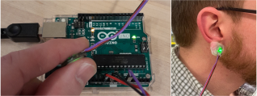

# Introduction

The purpose of this lab is to learn about measurement of photoplethysmogram (PPG) using a pulse oximeter. We will learn about driving a pulse oximeter using Arduino, and using Python serial reader to receive the signal at PC. We will also use filters to reduce the noise and study the affect of the filters on the signal.

# Background

1. A photoplethysmogram (PPG) is an optically obtained plethysmogram that can be used to detect blood volume changes in the microvascular bed of tissue. A PPG is often obtained by using a pulse oximeter which illuminates the skin and measures changes in light absorption. A conventional pulse oximeter monitors the perfusion of blood to the dermis and subcutaneous tissue of the skin.

   For more details, please see [Wikipedia – Photoplethysmogram](<https://en.wikipedia.org/wiki/Photoplethysmogram#:~:text=A%20photoplethysmogram%20(PPG)%20is%20an,measures%20changes%20in%20light%20absorption.>).

   - Below are images showing and ICU monitor where "Pleth" is PPG data as well as a pulse oximeter used at the UW Medical Center. 

      

      

1. Low pass filters can help with reducing the noise in the signals of sensors. Low pass filters exist in many different forms. For hardware side, as introduced in Lab 3, an RC circuit can be used as a low pass filter when output is connected to the capacitor. In this lab, we will look at the software side where filters are applied by code and algorithms.

1. A **moving average filter** is applied by averaging several previous data points. As the image below shows, each point of the filtered signal is the average of k previous near points in the original signal.

   For more details, please see [Wikipedia- Moving average](https://en.wikipedia.org/wiki/Moving_average#Other_weightings).

   

1. An **exponential decay filter** (also called exponential smoothing) is a rule of thumb method to filter out noise in time series signals. It can be implemented by the following equation:

   Sk = αxk + (1 - α) Sk-1

   where S is the filtered signal, x is the original signal and $/alpha$ is the exponential factor. For more details, please see [Wikipedia - Exponential smoothing](https://en.wikipedia.org/wiki/Exponential_smoothing).

# Preparation

Pre-lab computations:

- None but see Computer Preparation below

# Computer Preparation

We will use Python for signal process in this Lab. If you are not familiar with Python, please follow the steps to prepare Python workspace [here](/Lab6/anaconda.md). Detailed instruction on Python is beyond the scope of this lab, but it is recommended to explore more on Python, as it can be very useful in your future courses.

For more information on setting up Anaconda and Spyder click [here](/Lab6/anaconda.md).

# Parts, tools, supplies required:

- Arduino
- Pulse oximeter sensor

   

- [Source code (src) folder](src/)

# Procedure

All the code in this Lab is provided in the ['src'](src/) folder, but you are welcome to write you own code for any part of this lab.

1. **Setup hardware**

   1. Connect the pulse oximeter sensor to Arduino, red pin to 3.3V, black pin to GND and purple pin to Analog input **A0** by default.
 
      

   1. Connect the Arduino to your PC.

1. **Install and Upload Arduino Script**

   - [Install PulseSensor Library](https://pulsesensor.com/pages/installing-our-playground-for-pulsesensor-arduino)

   - [Pulse Sensor Code and Guide](https://pulsesensor.com/pages/code-and-guide)

## Test the sensor

1. Use two fingers to hold the sensor or use tape to fix the sensor on one of your fingers or on your ear. Make sure the front side of the sensor is touching your skin.

   

1. In Arduino IDE, go to 'Tools-Serial Plotter', if everything is set correctly, you should see similar plots as the following figure and a yellow LED on your Arduino blinking on your heartbeat. Make sure the baud rate is **57600**. If you see that signal reaches the upper limit 1000 or the peak is not obvious, you may need to adjust the pressure applied on the sensor.

   

1. ✏️ Take a photo of your sensor setup and a screenshot of the serial plotter.

## Record data on your PC

1. Open Spyder, make sure the virtual environment is correct.

   

1. In Spyder, open the file [serial_reader_PPG.py](src/serial_reader_PPG.py). You may need to change the serial port setting, as shown in the following figure.

   

1. Run the serial_reader_PPG.py Python script, making sure the sensor is correctly placed on your skin. It will record the raw PPG sensor reading for 10s. The data will be saved as a '.txt' file in the same folder as '**serial_reader_PPG.py**'.

   

1. If the recording is successful, you can see a plot pop up as the following figure shows.

   

1. ✏️ Take a screenshot of this figure.
1. Repeat this step to record 1 trial for each member in your group. Make sure to change the file name in the script. **Otherwise, it will overwrite the existing file**.

   

1. If you find any of the following errors, just close the current Console and run again.

   

   

   

1. In medical practice, data such as PPG or ECG are usually considered as the private of patients. So you are also welcome to use anonymous recording in this lab, for example, by writing '**member 1**' instead of your name.

## Filter the noise using moving average
1. In Spyder, open [moving_average_filter.py](src/moving_average_filter.py), remember to change the file name of your recorded data.

   

1. Run this script, a figure should pop up.
1. ✏️ Take a screenshot of the figure and describe what you find when applying moving average and with different window size k. You can use '**Zoom**' button to Zoom in and get a better observation.

   

1. Repeat the steps for each trial you just recorded.

## Filter the noise using exponential decay
1. In Spyder, open [exponential_decay_filter.py](src/exponential_decay_filter.py), enter the file name of your recorded data.
1. Run this script, a figure should pop up.
1. ✏️ Take a screen shot of the figure and describe what you find when applying moving average and with different exponential factors.
1. Repeat the steps for each trial you just recorded.

## Estimate your heart rate

1. In Spyder, open [heart_rate_estimate.py](src/heart_rate_estimate.py), enter the file name of your recorded data.
1. Run this script, a figure should pop up and show the filtered signal by exponential decay.
1. You can check the coordinates of the peaks by pointing your cursor on the peak and the coordinate is on the top right corner.

   

1. Find the time interval between 2 peaks, as the following figure shows. Repeat 5 times and calculate the average of t.

   

## Estimate your heart rate
1. Use the following equation, where `hr` is the heart rate and `t` is time in seconds.

   `hr = 60 / t`

1. ✏️ Write down the heart rate for each member of your group.
1. Do some exercises, such as jumping jacks. Then take measurement again and estimate your heart rate, by repeating step 4 and 7. You need to be quick as your heart rate may recover to baseline quickly.
1. ✏️ Write down the heart rate after exercises and compare with the heart rate before exercises.
1. ✏️ Verify the result by counting pulses on your wrist ([use this video for reference](https://youtu.be/AHHr8qNU9QY?t=10)). It is always important to validate your sensor readings with a known accurate source.

# Write-Up

Same instructions as previous TECHIN 512 labs.

# Frequently Asked Questions
**Q: I have Python installed on my PC, why should I use Anaconda?**

A: If you have Python already installed, it could work well in this lab. However, Anaconda can be very useful in the future when you work on several Python projects simultaneously. Anaconda helps you to create and manage multiple virtual Python environments, which could prevent conflict of library dependencies.  
