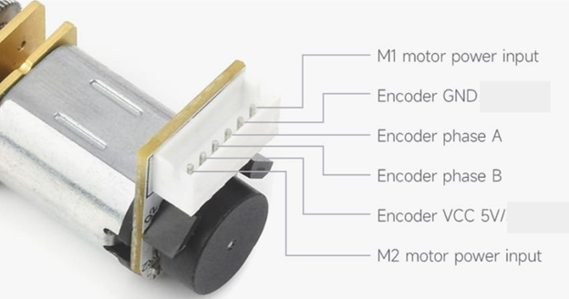
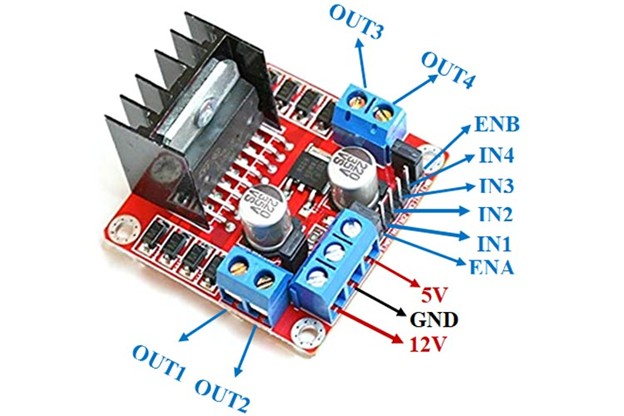
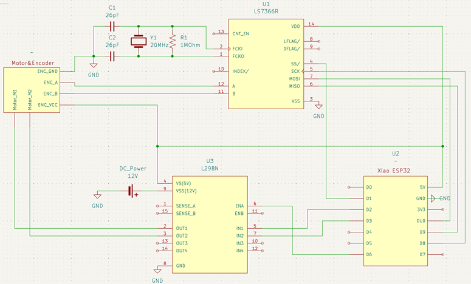
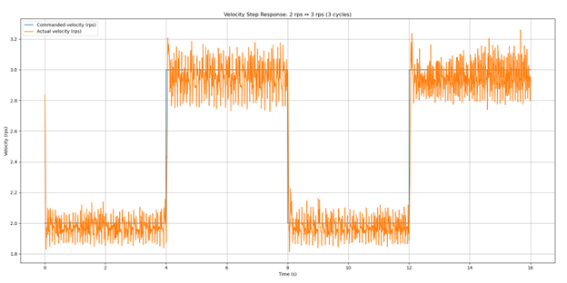

# Motor Control Lab Manual

## Introduction

The purpose of this lab is to study how to use an encoder sensor to achieve PID feedback control on DC motors.

## Parts, tools, and supplies required

- DC motor with encoder  
- LS7366R encoder counter chip  
- L298N motor driver board  
- ESP32  
- 1 × 1 MΩ resistor  
- 2 × ~20 pF capacitor  
- 1 × 20 MHz crystal oscillator  

---

## Procedure

### 1. Wiring of the system

The following figure shows the pins of the motor. Please note that the motor power (12 V) and encoder power (5 V) are different.

The following figure (from Components101) shows the pins of the L298N motor driver board.

The system wiring diagram is shown in the following figure.  
(Note: all ground pins should be connected together.)

---

### 2. Check encoder readings

2.1
Once you have the system wired, open Thonny and run `enc_test_.py` on the ESP32. You should see the encoder counting outputs.

2.2 ✏️
Manually rotate the motor for one round, record the encoder countings. If the wiring is correct, you should see around 3000 counts. Write down the reading.

2.2 ✏️
Manually rotate the motor for one round in the opposite direction, and record the encoder countings. Does the reading go back to around 0?

---

### 3. Open-loop control (no feedback)

3.1
Use Thonny to open `open_loop_duty_ctl.py`. It will send a PWM wave with a certain duty to the L298N motor driver board. The L298N will control the current of the motor according to the PWM duty, resulting in different motor output torques.

3.2
Change the duty percentage to 80%:

python
duty_pct = 80
Run the code. If the motor wiring is correct, you should see the motor rotating.

3.3 ✏️
Change the duty percentage to 20%:

python
Copy code
duty_pct = 20
Run the code. Does the motor rotate? Why or why not?
(Hint: friction of gearbox, motor output torque.)

3.4 ✏️
Use [binary search](https://en.wikipedia.org/wiki/Binary_search), try different duty percentages, and find the threshold duty percentage at which the motor starts rotating. Note this down.

### 4. PID feedback control
4.1
Use Thonny to open `pid_step_response_speed.py`. This code can apply PID feedback control on the speed of the motor. With a time interval of 4 seconds, the motor will switch its speed between 2 rps and 3 rps (rounds per second). Run the code on the ESP32; you should be able to see the motor rotating at different speeds.

4.2 ✏️
Copy the code `pid_step_response_speed.py` to the ESP32 local `code.py`. Now the ESP32 will automatically run the code when powered on (you might need to disconnect and reconnect).

When the motor is rotating, use Spyder or your preferred PC Python IDE to run `pid_step_response_plot.py`. You should be able to get a plot similar to the figure shown in the lab handout. Include the plot in your lab report.

4.3 ✏️
In the ESP32 local `code.py`, for each P gain (VKP=), I gain (VKI=), and D gain (VKD=), try at least a small value and a large value (keep the other 2 as the default value).

Each time you change the gains:

Run the code on the ESP32.

Use Spyder or your preferred PC Python IDE to run pid_step_response_plot.py.

Include the plot for each change, and then comment on the control performance (fast/slow response, large/small overshoot, large/small oscillation, large/small steady-state error, and so on).

4.4 ✏️
Based on your previous results, further adjust and iterate the PID gains, and include the figure of the best one you get (optimized balance of response, overshoot, oscillation, and steady-state error).

You can refer to the slides on the effectiveness of the PID gains. Also, note down the best PID gain values.